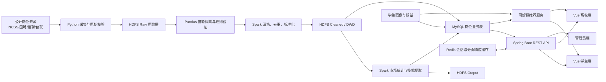
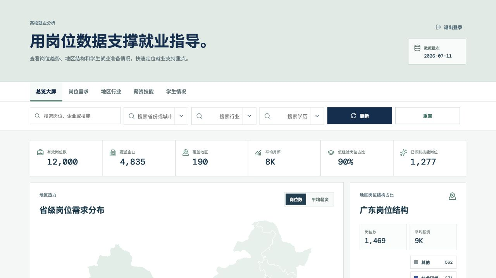
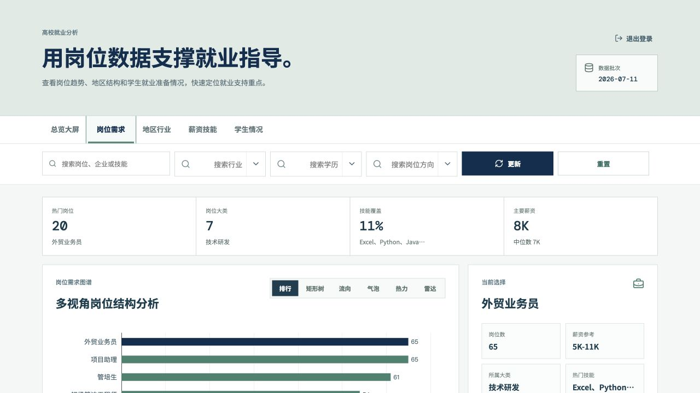
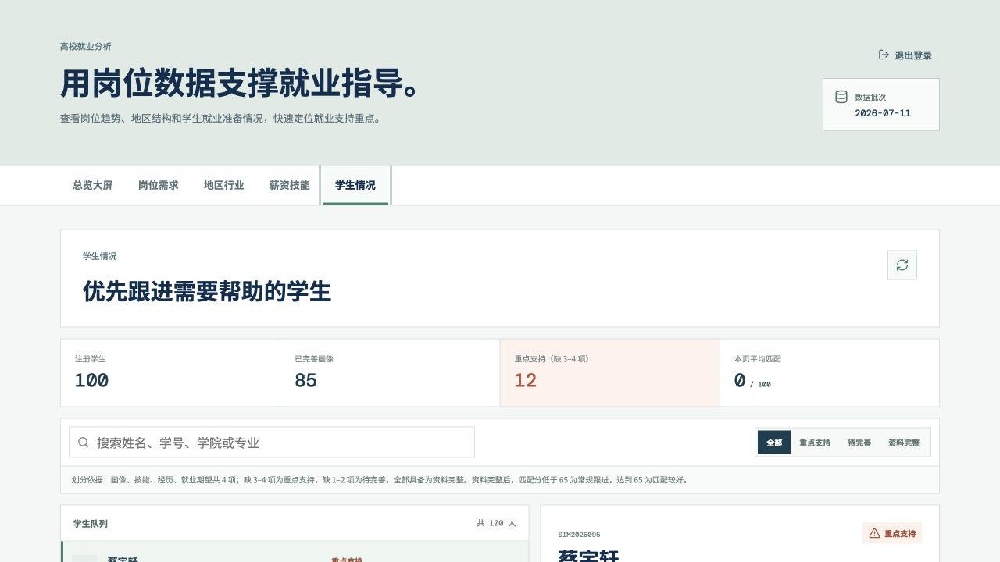
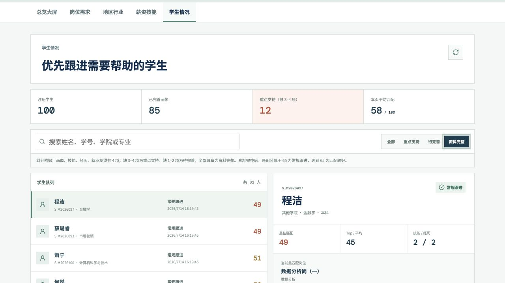
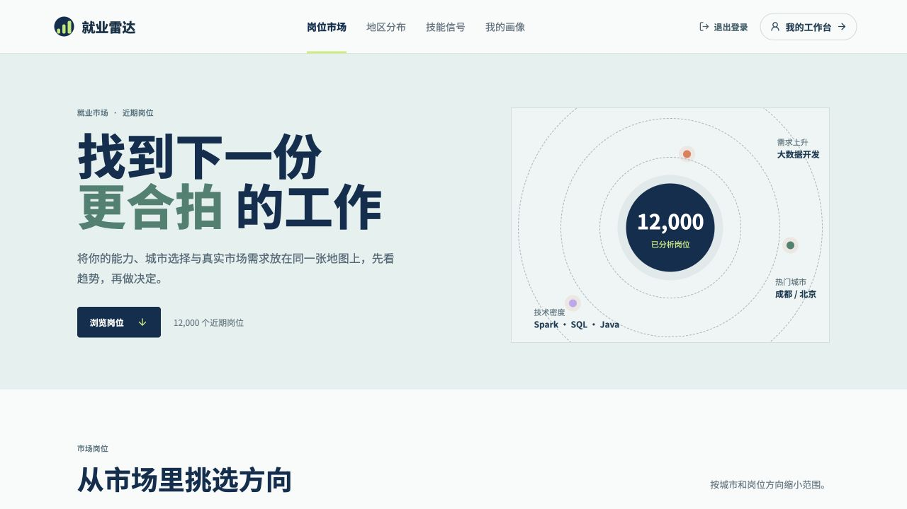
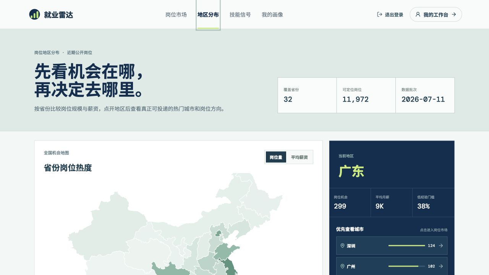
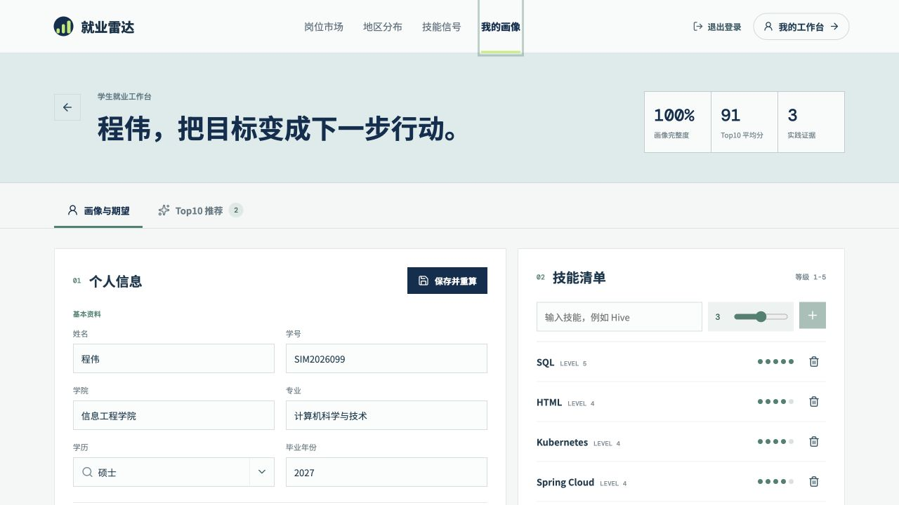
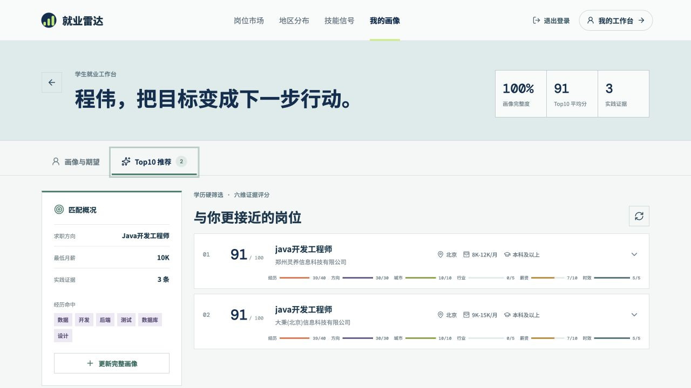
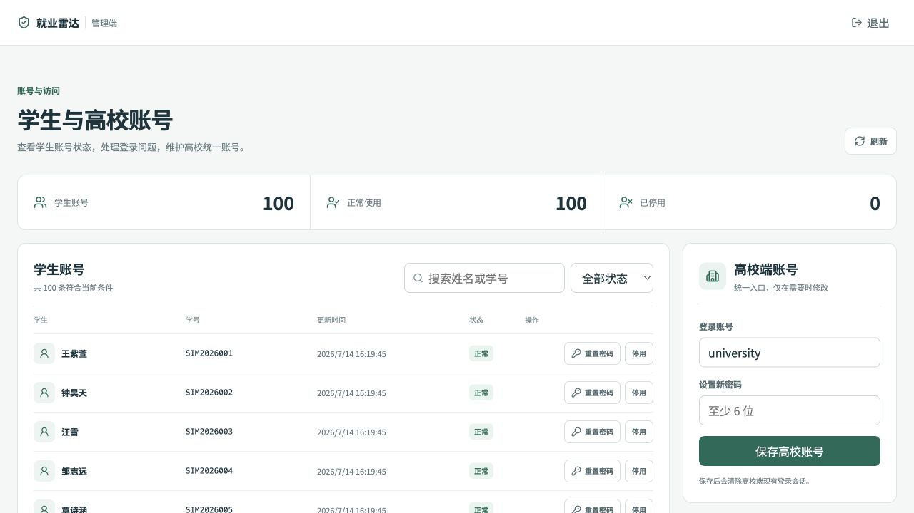

# 基于 Spark 的高校智慧就业大数据分析平台完整项目文档

> 文档版本：2026-07-15
> 项目批次：2026-07-11 公开岗位数据批次
> 适用场景：课程设计报告、项目答辩、开发交接、部署维护与成果截图说明

## 1. 项目概述

### 1.1 建设背景

高校就业工作通常同时面临三类问题：公开招聘岗位数量大且字段不统一；学生填写的能力、经历和就业期望难以与岗位要求直接对齐；高校端缺少能够解释“岗位需求、地区结构、薪资门槛、学生准备状态”的统一分析工具。

本项目以公开招聘岗位为真实主数据，建设从“数据采集—HDFS 存储—Spark 清洗分析—MySQL 服务化—学生岗位推荐—高校辅助决策”贯通的就业大数据平台。平台包含学生端、高校端和管理员端三个角色，并使用 100 名明确标记的模拟学生验证完整业务链路。

### 1.2 数据使用边界

项目没有高校真实毕业去向和签约数据，因此遵守以下原则：

- 不生成虚假的就业率、签约率或培养质量结论。
- 学生数据来自学生自主填写、学校授权匿名导入或明确标记的模拟数据。
- 岗位数据只用于展示当前批次的需求现状和近期信号，不包装成长期预测。
- 推荐分表示当前画像与岗位的接近程度，不预测录用结果。
- 公开数据采集遵守公开访问边界，不绕过登录权限，不在仓库保存 Cookie、令牌或数据库密码。

### 1.3 当前主要成果

| 成果项 | 当前结果 |
| --- | ---: |
| 原始 NCSS 合并岗位 | 10,834 条 |
| NCSS 第一版清洗结果 | 10,809 条，剔除 25 条 |
| 四源统一有效岗位 | 12,000 条 |
| 最终来源分布 | 国聘 297、猎聘 752、NCSS 10,408、智联 543 |
| 岗位技能明细 | 2,505 条 |
| 市场统计明细 | 588 条 |
| 模拟学生 | 100 人、100 个账号 |
| 学生关联数据 | 329 条技能、199 条经历、90 条就业期望 |
| 学生情况分页性能 | 首屏约 0.013 秒；Redis 命中约 0.0185 秒 |

---

## 2. 总体功能与技术架构

### 2.1 角色与功能设计

| 角色 | 核心功能 |
| --- | --- |
| 学生端 | 注册登录、岗位市场、关键词/城市/方向筛选、岗位分页、岗位详情、收藏、技能需求信号、地区机会地图、个人画像、技能等级、项目/实习/获奖经历、就业期望、Top10 推荐与推荐依据 |
| 高校端 | 市场总览、岗位需求多视图、地区行业分析、薪资学历技能分析、学生情况分页、资料完整度分层、重点支持学生识别 |
| 管理员端 | 学生账号搜索与分页、账号启停、密码重置、高校统一账号维护 |

### 2.2 端到端数据流



### 2.3 技术栈

| 层级 | 技术与用途 |
| --- | --- |
| 数据采集 | Python 3、Requests、BeautifulSoup、CSV/JSONL；负责公开接口请求、详情页解析、重试限速、批次记录和质量报告 |
| 首轮处理 | Pandas；用于字段探索、单源清洗规则试验、缺失率与分布分析 |
| 大数据处理 | Hadoop 3.5.0、HDFS、Spark/PySpark 4.1.x、Spark SQL、Parquet；负责多源统一、去重、分类、技能提取与聚合 |
| 业务数据库 | MySQL 8、InnoDB、utf8mb4、外键和组合索引；承载岗位、统计、学生画像、账号与会话 |
| 缓存 | Redis 7；承载登录会话缓存和高校端学生情况分页响应缓存 |
| 后端 | Java 17、Spring Boot 3.3、Spring Security、Spring JDBC、MyBatis-Plus、Bean Validation、Springdoc OpenAPI |
| 前端 | Vue 3.5、Vite 6、ECharts 6、Lucide Vue、原生响应式 CSS |
| 测试 | JUnit 5、Spring Boot Test、Pytest、Playwright |
| 部署 | Ubuntu Server 24.04 虚拟机、Shell、Docker Compose、Nginx；开发阶段使用 SSH 隧道和 Vite 同源代理 |

### 2.4 项目目录分工

```text
Spark-employment-Platform/
├── data_source/        # 多来源岗位采集、原始文件、采集日志
├── data_processing/    # Pandas、Spark、字典、分析输出
├── infrastructure/     # Spark、MySQL、Redis 配置示例
├── database/           # MySQL 表结构、迁移和模拟学生数据
├── backend/            # Spring Boot API、认证、推荐、分析
├── frontend/           # Vue 三端页面与 Playwright 测试
├── shared/             # 统一 schema、常量和评分权重
├── deployment/         # Dockerfile、Compose、Nginx
├── docs/               # 需求、设计、进度和本说明文档
└── scripts/            # 启动与测试脚本
```

---

## 3. 第一部分：功能设计、整体框架与虚拟机基础设施

### 3.1 设计思路

整体设计采用“离线大数据处理 + 在线业务查询”的组合：HDFS 保存可追溯原始数据和 Parquet 结果，Spark 负责批量计算，MySQL 保存前端真正需要查询的结构化快照，Redis 缓存高频结果，Spring Boot 统一提供 API。这样避免前端直接查询 HDFS，也避免每个页面请求都实时运行 Spark。

在线链路与离线链路分离后，系统具备以下优点：

- 原始数据可以按来源和日期追溯。
- 清洗规则变化时，可以从 Raw 层重新计算，不破坏原始数据。
- Spark 输出采用同日期全量快照，前端看到的岗位、技能和统计口径一致。
- MySQL 保留索引和外键，适合分页、筛选、账号及学生画像事务。
- Redis 故障时可以回源 MySQL，不作为唯一数据源。

### 3.2 虚拟机与端口规划

当前部署以单台 Ubuntu Server 24.04 虚拟机完成开发和演示，Java 使用 OpenJDK 17。主要端口如下：

| 服务 | 端口 | 说明 |
| --- | ---: | --- |
| HDFS NameNode RPC | 9000 | `hdfs://hwadee01:9000` |
| HDFS NameNode Web | 9870 | 查看文件系统、容量和 DataNode 状态 |
| YARN ResourceManager | 8088 | 查看 YARN 应用（使用 YARN 时） |
| Spark Master | 7077 | Spark Standalone 提交地址 |
| Spark Master Web UI | 8080 | 查看 Worker 和应用，因此后端不使用 8080 |
| Spark Worker Web UI | 8081 | 查看 Worker 资源 |
| Spring Boot | 8082 | REST API 统一入口 |
| MySQL | 3306 | 业务数据库，仅允许受控网络访问 |
| Redis | 6379 | 会话和缓存，建议只监听本机/内网 |
| Vue/Vite | 5173 | 开发前端或容器前端 |

> 截图建议 1：虚拟机终端执行 `jps`，显示 NameNode、DataNode、SecondaryNameNode、ResourceManager、NodeManager、Master、Worker 和后端 Java 进程。
> 截图建议 2：浏览器打开 NameNode Web UI 与 Spark Master Web UI，分别截图 HDFS 状态和 Spark Worker 在线状态。

### 3.3 Hadoop 与 HDFS 配置步骤

#### 3.3.1 Java 与环境变量

```bash
sudo apt update
sudo apt install -y openjdk-17-jdk openssh-server
java -version

export JAVA_HOME=/usr/lib/jvm/java-17-openjdk-amd64
export HADOOP_HOME=$HOME/opt/hadoop-3.5.0
export HADOOP_CONF_DIR=$HADOOP_HOME/etc/hadoop
export PATH=$PATH:$HADOOP_HOME/bin:$HADOOP_HOME/sbin
```

#### 3.3.2 单机伪分布式关键配置

`core-site.xml` 关键项：

```xml
<property>
  <name>fs.defaultFS</name>
  <value>hdfs://hwadee01:9000</value>
</property>
```

`hdfs-site.xml` 建议关键项：

```xml
<property>
  <name>dfs.replication</name>
  <value>1</value>
</property>
<property>
  <name>dfs.namenode.name.dir</name>
  <value>file:///home/miracle/hadoop-data/namenode</value>
</property>
<property>
  <name>dfs.datanode.data.dir</name>
  <value>file:///home/miracle/hadoop-data/datanode</value>
</property>
```

单虚拟机使用副本数 1；如果后续扩展为多节点，应调整副本数并在 `workers` 中登记各 Worker 主机。首次启动前只执行一次格式化：

```bash
hdfs namenode -format
start-dfs.sh
start-yarn.sh
jps
```

#### 3.3.3 HDFS 分层设计

```text
/employment-platform/
├── raw/
│   ├── jobs/source=guopin/date=2026-07-11/
│   ├── jobs/source=liepin/date=2026-07-11/
│   ├── jobs/source=ncss/date=2026-07-11/
│   ├── jobs/source=zhilian/date=2026-07-11/
│   └── dictionaries/
├── cleaned/
│   ├── jobs/date=2026-07-11/source=.../
│   └── job_skills/date=2026-07-11/source=.../
├── warehouse/
│   └── dwd/
│       ├── jobs/date=2026-07-11/source=.../
│       └── job_profiles/date=2026-07-11/source=.../
├── output/
│   └── job_statistics/date=2026-07-11/
│       ├── city_distribution/
│       ├── industry_distribution/
│       ├── education_distribution/
│       ├── experience_distribution/
│       ├── source_distribution/
│       ├── hot_jobs/
│       ├── hot_skills/
│       └── job_category_distribution/
└── archive/             # 历史批次或停用结果
```

初始化命令：

```bash
hdfs dfs -mkdir -p /employment-platform/{raw,cleaned,warehouse,output,archive}
hdfs dfs -mkdir -p /employment-platform/raw/jobs
hdfs dfs -mkdir -p /employment-platform/raw/dictionaries
hdfs dfs -ls -R /employment-platform
```

原始数据上传示例：

```bash
hdfs dfs -mkdir -p /employment-platform/raw/jobs/source=ncss/date=2026-07-11
hdfs dfs -put -f jobs_ncss_2026-07-11_merged.csv \
  /employment-platform/raw/jobs/source=ncss/date=2026-07-11/
```

#### 3.3.4 HDFS 维护

```bash
# 服务检查
jps
hdfs dfsadmin -report
hdfs fsck /employment-platform

# 容量与目录检查
hdfs dfs -du -h /employment-platform
hdfs dfs -count -h /employment-platform/raw/jobs

# 安全重算：保留 Raw，只覆盖目标日期的计算层
hdfs dfs -rm -r /employment-platform/cleaned/jobs/date=2026-07-11
hdfs dfs -rm -r /employment-platform/warehouse/dwd/jobs/date=2026-07-11
```

生产维护时不直接删除 Raw 层；需要清理时先迁移到 Archive，并记录数据日期、来源和重算原因。

> 截图建议 3：执行 `hdfs dfs -ls -R /employment-platform`，截图 Raw、Cleaned、DWD、Output 四层目录。
> 截图说明可写：“原始数据按来源和日期分区，清洗表与统计结果均使用 2026-07-11 同一快照。”

### 3.4 Spark 配置与运行

当前批处理命令使用 `$HOME/opt/spark-4.1.2`，Master 为 `spark://192.168.64.2:7077`。设置环境变量：

```bash
export SPARK_HOME=$HOME/opt/spark-4.1.2
export HADOOP_CONF_DIR=$HOME/opt/hadoop-3.5.0/etc/hadoop
export PATH=$PATH:$SPARK_HOME/bin:$SPARK_HOME/sbin
```

单节点资源需要为 HDFS、Spark、MySQL 和后端预留内存。可在 `spark-env.sh` 中设置：

```bash
export JAVA_HOME=/usr/lib/jvm/java-17-openjdk-amd64
export SPARK_MASTER_HOST=192.168.64.2
export SPARK_MASTER_PORT=7077
export SPARK_WORKER_MEMORY=2g
export SPARK_WORKER_CORES=2
```

启动与检查：

```bash
$SPARK_HOME/sbin/start-master.sh
$SPARK_HOME/sbin/start-worker.sh spark://192.168.64.2:7077
jps
```

标准执行顺序：

```bash
# 1. 多源清洗并生成 DWD 岗位表
$SPARK_HOME/bin/spark-submit \
  --master spark://192.168.64.2:7077 \
  --conf spark.hadoop.fs.defaultFS=hdfs://hwadee01:9000 \
  --conf spark.sql.shuffle.partitions=8 \
  data_processing/spark_jobs/job_cleaning.py --date 2026-07-11

# 2. 市场统计
$SPARK_HOME/bin/spark-submit \
  --master spark://192.168.64.2:7077 \
  --conf spark.hadoop.fs.defaultFS=hdfs://hwadee01:9000 \
  --conf spark.sql.shuffle.partitions=8 \
  data_processing/spark_jobs/market_statistics.py --date 2026-07-11

# 3. 岗位分类和技能提取
$SPARK_HOME/bin/spark-submit \
  --master spark://192.168.64.2:7077 \
  --conf spark.hadoop.fs.defaultFS=hdfs://hwadee01:9000 \
  --conf spark.sql.shuffle.partitions=8 \
  data_processing/spark_jobs/skill_extraction.py --date 2026-07-11

# 4. JDBC 全量刷新 MySQL 快照
$SPARK_HOME/bin/spark-submit \
  --master spark://192.168.64.2:7077 \
  --jars /path/to/mysql-connector-j.jar \
  data_processing/spark_jobs/export_to_mysql.py --date 2026-07-11
```

如果日期分区已经存在，需要明确追加 `--mode overwrite`，避免误覆盖。每次变更城市口径、行业字典或新增来源后，都必须依次重跑四步。

### 3.5 MySQL 配置与维护

数据库使用 MySQL 8、InnoDB 和 `utf8mb4`。核心配置：

```ini
[mysqld]
character-set-server=utf8mb4
collation-server=utf8mb4_unicode_ci
```

连接信息通过虚拟机环境文件或环境变量提供：

```bash
export MYSQL_JDBC_URL='jdbc:mysql://127.0.0.1:3306/spark_employment?useUnicode=true&characterEncoding=utf8&serverTimezone=Asia/Shanghai'
export MYSQL_USER='应用账号'
export MYSQL_PASSWORD='只保存在本机的密码'
```

主要数据表：

| 表 | 用途 |
| --- | --- |
| `job` | Spark 标准岗位快照，主键为 `source:source_job_id` |
| `job_skill` | 字典抽取的岗位技能明细 |
| `market_statistic` | 城市、行业、学历、来源、技能等聚合统计 |
| `student` | 学生基础画像和画像完成状态 |
| `student_skill` | 学生技能及 1–5 等级 |
| `student_experience` | 项目、实习、获奖经历 |
| `job_preference` | 岗位、城市、行业和最低薪资期望 |
| `platform_account` | STUDENT、UNIVERSITY、ADMIN 三类账号 |
| `auth_session` | 服务端会话 Token 哈希和过期时间 |

岗位表在城市、岗位类别、来源日期和薪资上建立索引；学生技能采用 `(student_id, skill_name)` 唯一约束；学生关联表使用外键级联删除，保证删除学生时不会留下孤立数据。

常用维护命令：

```bash
# 表和行数检查
mysql -e "USE spark_employment; SHOW TABLES;"
mysql -e "USE spark_employment; SELECT source_name, COUNT(*) FROM job GROUP BY source_name;"

# 备份
mysqldump --single-transaction spark_employment > spark_employment_$(date +%F).sql

# 恢复（先在测试库验证）
mysql spark_employment < spark_employment_2026-07-11.sql
```

Spark 导出使用 `truncate=true + overwrite` 保留建表时创建的索引结构。执行前应确认目标快照、备份数据库，并在导出后核对 `job`、`job_skill` 和 `market_statistic` 数量。

### 3.6 Redis 配置与维护

Redis 用于两类数据：

1. 登录会话缓存：`employment:session:{tokenHash}`。
2. 高校学生情况分页缓存：`employment:university:students:v{version}:{page}:{size}:{status}:{keywordSha256}`。

学生分页缓存 TTL 为 5 分钟。学生注册、画像、技能、经历、就业期望或账号启停成功提交后，只递增版本号，不执行低效的 `KEYS + 批量删除`；旧缓存由 TTL 自动回收。Redis 不可用时后端捕获异常并回源 MySQL。

建议配置：

```conf
port 6379
bind 127.0.0.1
maxmemory 512mb
maxmemory-policy allkeys-lru
```

仓库示例曾使用 `bind 0.0.0.0`，实际部署应限制为本机或虚拟机内网，并通过防火墙阻止公网访问。

维护命令：

```bash
redis-cli ping
redis-cli INFO memory
redis-cli INFO stats
redis-cli --scan --pattern 'employment:university:students:*'
redis-cli TTL '<具体缓存 key>'

# 仅失效学生情况缓存，不执行 FLUSHALL
redis-cli INCR employment:university:students:version
```

实测同一学生分页冷查询约 0.6633 秒，Redis 命中约 0.0185 秒，内容一致，约提升 35 倍。

### 3.7 部署与服务维护

后端监听 `0.0.0.0:8082`，前端默认使用同源 `/api`。Docker Compose 可一次启动 MySQL、Redis、后端和前端，Nginx 将 `/api` 转发至后端，其余请求转发至前端。

```bash
docker compose up --build -d
docker compose ps
curl http://127.0.0.1:8082/api/health
```

开发环境曾使用本机 Vite `5173`、SSH 隧道转发虚拟机 `8082`，避免向公网直接暴露 MySQL、Redis、HDFS 和 Spark 管理端口。

---

## 4. 第二部分：NCSS 数据采集、第一次处理分析、后端基础接口与高校端完善

### 4.1 NCSS 公开岗位采集设计

NCSS 是国家大学生就业服务平台，岗位与高校毕业生场景匹配度较高，因此作为主数据来源。采集程序分为四层：

- `BaseCrawler`：统一 Session、超时、重试、限速和原始响应保存。
- `NcssJobCrawler`：调用公开列表接口，按岗位 ID 拉取公开详情页。
- `job_parser.py`：解析列表与详情，统一输出字段。
- `run_crawler.py`：负责命令行参数、地区/学历/类别/薪资组合、批次目录、日志、manifest、CSV 与 JSONL 输出。

列表和详情入口：

```text
https://www.ncss.cn/student/jobs/jobslist/ajax/
https://www.ncss.cn/student/jobs/{jobId}/detail.html
```

采集配置默认每页 20 条、最多 5 页、请求间隔 1 秒、超时 20 秒、失败重试 2 次。采集器支持以下扩量维度：

- `areaCode`：省级地区。
- `degreeCode`：学历。
- `categoryCode`：职位类别。
- `monthPay`：薪资区间。
- `jobType`：全职、兼职、实习。
- `--seen-jsonl`：读取历史岗位 ID，跳过已采集记录。

输出按日期与运行批次隔离：

```text
data_source/data/raw/ncss_jobs/date=YYYY-MM-DD/run=YYYYMMDD_HHMMSS/
├── api_responses/                     # 列表原始 JSON
├── detail_pages/                      # 岗位详情 HTML
├── jobs_ncss_YYYY-MM-DD_batch001.jsonl
├── jobs_ncss_YYYY-MM-DD_batch001.csv
└── crawl_manifest.json
```

`crawl_manifest.json` 记录查询条件、开始结束时间、页数、原始数量、去重数量和详情失败记录，便于失败恢复与审计。

### 4.2 NCSS 采集迭代过程

1. 首轮采集 100 条，验证列表、详情和字段解析，岗位描述缺失率为 2%。
2. 增加 `--start-page`，尝试从第 6 页续抓；公开接口返回需要登录后停止，不绕过权限。
3. 按 12 个地区扩量到 1,200 条，岗位 ID 无重复；补充职责标题抽取和详情原文回退。
4. 按职业类别、学历、薪资和职位类型分片扩量；后续新增数量仅 56、28、4 条，边际收益降低后停止重复请求。
5. 使用 `merge_raw_jobs.py` 合并 12 个正式批次，以 `source_job_id` 去重，得到 10,834 条推荐原始总表。
6. 冻结采集批次并归档失败实验和非主线数据，保证后续处理只使用一个可追溯输入。

原始质量结果：

| 指标 | 结果 |
| --- | ---: |
| 总记录 | 10,834 |
| 唯一岗位 ID | 10,834 |
| 重复岗位 ID | 0 |
| 岗位描述缺失 | 39（0.36%） |
| 职责显式标题抽取 | 5,117 |
| 职责详情原文回退 | 5,678 |
| 职责确实缺失 | 39 |

> 截图建议 4：打开 `raw_data_quality_report.md`，截图“记录数、唯一 ID、重复数、必填字段缺失率”。
> 可配文：“NCSS 合并原始表 10,834 条，岗位 ID 无重复，岗位描述缺失率 0.36%。”

### 4.3 NCSS 第一次清洗与分析

Pandas 第一版处理完成以下规则：

- 将 NCSS 字段映射到统一岗位字段。
- 按岗位 ID 去重。
- 将 `xK-yK` 解析为月薪上下限整数。
- 过滤明确要求 3 年以上经验且没有应届/实习提示的岗位。
- 过滤“面向社会”且没有学生提示的岗位。
- 保留原始薪资文本和来源 URL，便于审计。
- 对缺失字段不编造内容，`experience` 和 `district` 缺失保留并在质量报告说明。

第一版清洗结果：

| 指标 | 结果 |
| --- | ---: |
| 输入 | 10,834 |
| 清洗后 | 10,809 |
| 剔除 | 25 |
| 3 年以上硬经验门槛 | 22 |
| 无学生提示的社会招聘 | 3 |
| 薪资范围解析成功 | 10,834 |

清洗后学历分布：专科及以上 4,651、本科及以上 4,194、不限 1,193、硕士及以上 614、博士及以上 157。行业样例包括教育/培训/院校 1,045、机械制造 1,027、计算机软件 645、互联网/电子商务 635。

清洗输出：

```text
data_processing/data/cleaned/ncss_jobs/date=2026-07-11/run=20260711_163237/
├── cleaned_jobs_ncss_2026-07-11.jsonl
├── cleaned_jobs_ncss_2026-07-11.csv
├── excluded_jobs_ncss_2026-07-11.jsonl
├── excluded_jobs_ncss_2026-07-11.csv
├── cleaning_report.json
└── cleaning_report.md
```

#### 清洗后岗位样式示例

| 字段 | 示例/说明 |
| --- | --- |
| `job_id` | 来源内稳定岗位 ID |
| `job_name` | 大数据开发工程师 |
| `company_name` | 某信息技术有限公司 |
| `industry` | 计算机软件 |
| `city` | 成都（统一去除“市”后缀） |
| `education` | 本科及以上 |
| `experience` | 经验不限；源没有信息时不伪造 |
| `salary_raw` | 8K-12K |
| `salary_min/max` | 8000 / 12000 |
| `job_description` | 清理零宽字符后的岗位描述原文 |
| `job_url` | 原岗位公开链接 |
| `source` | ncss |
| `crawl_date` | 2026-07-11 |

> 截图建议 5：用表格软件打开清洗后 CSV，截取 `job_name`、`company_name`、`city`、`education`、`salary_min`、`salary_max`、`source` 等列。
> 截图建议 6：展示 `excluded_jobs` 与剔除原因，说明系统保留异常数据而不是直接丢弃且无法追溯。

### 4.4 后端基础接口设计与实现

后端采用 Controller—Service—Mapper/Repository—MySQL 分层。Controller 只负责参数和响应；Service 实现业务规则；MyBatis-Plus 与 JdbcTemplate 负责分页、筛选和复杂聚合；统一异常处理返回结构化错误。

主要 API：

| 模块 | 接口 | 功能 |
| --- | --- | --- |
| 健康 | `GET /api/health` | 服务与数据批次检查 |
| 认证 | `POST /api/auth/login` | 按 STUDENT/UNIVERSITY/ADMIN 登录 |
| 认证 | `POST /api/auth/student/register` | 学号注册学生账号 |
| 认证 | `GET /api/auth/me`、`POST /api/auth/logout` | 当前账号和退出 |
| 岗位 | `GET /api/jobs` | 关键词、城市、类别、薪资、后端分页 |
| 岗位 | `GET /api/jobs/{jobKey}` | 岗位详情与来源信息 |
| 岗位 | `GET /api/jobs/filters` | 动态城市和岗位类别选项 |
| 市场 | `GET /api/market/overview` | 指定日期市场概览 |
| 市场 | `GET /api/market/statistics/{type}` | 技能、城市、行业等统计 |
| 学生 | `GET/PUT /api/students/{id}/profile` | 查询与保存画像 |
| 学生 | `/skills`、`/experiences`、`/preference` | 技能、经历、就业期望维护 |
| 推荐 | `GET /api/recommendations/top10` | Top10 岗位推荐 |
| 推荐 | `GET /api/recommendations/{jobKey}/match` | 单岗位匹配解释 |
| 高校 | `GET /api/university/market-dashboard` | 综合筛选市场驾驶舱 |
| 高校 | `GET /api/university/industry-salary-distribution` | 十大行业薪资分布 |
| 高校 | `GET /api/university/students` | 学生情况分页、搜索与分层 |
| 管理 | `/api/admin/accounts` | 账号列表、启停和密码重置 |

#### 认证与权限

当前认证实际采用“随机 Bearer Token + 服务端会话”，不是无状态 JWT：

- 密码使用 BCrypt 哈希保存。
- 登录产生 32 字节随机 Token，只把 SHA-256 哈希写入 MySQL。
- Redis 缓存 Token 对应的账号信息，MySQL 为最终回退。
- Spring Security 使用无状态过滤器验证 Bearer Token。
- ADMIN 只能管理学生账号；高校端只能访问高校分析；学生只能访问自己的画像和推荐。

#### 推荐实现

推荐先按学历做硬门槛过滤，再对最多 5,000 个近期有效岗位评分，最终返回 Top10。高校学生概览为降低延迟，每人抽取 400 个稳定采样候选。六维权重为：

| 维度 | 分值 |
| --- | ---: |
| 项目/实习/获奖经历相关性 | 40 |
| 期望岗位方向 | 30 |
| 城市 | 10 |
| 最低期望薪资 | 10 |
| 行业 | 5 |
| 岗位时效 | 5 |

技能作为学生画像记录，不直接参与排序；推荐响应返回经历命中词和可读推荐理由。这样能够说明分数来自哪些证据，避免把技能关键词数量简单等同于学生能力。

### 4.5 高校端后续功能设计与完善

高校端最终形成五个页面：

1. **总览大屏**：岗位数、企业数、城市数、行业数、平均薪资、低经验门槛岗位；省级地图、地区结构、热门地区与行业。
2. **岗位需求**：排行、矩形树、桑基图、气泡图、热力图、雷达图，支持从岗位大类钻取细分岗位。
3. **地区行业**：省级岗位与薪资地图、地区画像、行业树图、地区散点、雷达和地区×行业热力矩阵。
4. **薪资技能**：薪资区间、学历门槛、高频技能、地区薪资对比和可行动建议。
5. **学生情况**：学生分页、关键词搜索、资料完整度筛选、Top5 匹配、主要差距和证据说明。

学生情况经历了重点性能迭代：原接口一次读取 100 人并逐人计算推荐，耗时约 3.75 秒；改为服务端每页 10 人，只对当前页计算，首屏约 0.013 秒。同时加入 Redis 分页缓存、300ms 搜索防抖、上一页/下一页和空值原因说明。

学生状态不再使用模糊的“困难学生/普通学生”二分，而采用可核验规则：

- 缺少画像、技能、经历、就业期望中的 3–4 项：重点支持。
- 缺少 1–2 项：待完善。
- 缺少 0 项：资料完整。
- 资料完整后，匹配分低于 65 为常规跟进，达到 65 为匹配较好。

真实模拟数据分层结果为重点支持 12 人、待完善 6 人、资料完整 82 人，总和为 100。

以下图片由实际运行系统生成，截图时间为 2026-07-15，页面数据来自虚拟机后端与 MySQL 当前批次。



*图 7　高校端总览大屏：12,000 条有效岗位、4,835 家企业、190 个地区及省级岗位结构。*



*图 8　岗位需求页：排行、矩形树、流向、气泡、热力和雷达六种分析模式。*



*图 9　学生情况页：服务端分页、资料分层、差距证据与可核验划分规则。*



*图 10　资料完整学生筛选结果：展示常规跟进、匹配较好、Top5 平均分和已有证据。*

---

## 5. 第三部分：智联数据补充、第一次处理分析与高校端页面迭代

### 5.1 智联数据补充

智联招聘作为第四数据源补充现有岗位覆盖。2026-07-11 原始快照共 578 条，为无表头 CSV。为了避免把旧脚本中的会话信息带入仓库，只保留数据快照，不提交 Cookie 或认证信息。

Spark 使用固定 13 列模式读取：

```text
job_name, company_name, industry, company_scale,
location_detail, city, district, education, experience,
salary_raw, job_description, job_url, company_url
```

处理思路：

- 使用岗位链接 SHA-256 生成稳定 `job_id`。
- 城市、区县和描述统一清理零宽字符。
- 只解析月薪范围；日薪、时薪、次薪和面议不强制换算。
- 支持 `1-1.5万·13薪`、`8000-15000元` 等月薪文本。
- 与其他来源使用相同的城市、行业、学历和去重规则。
- 以来源、岗位、公司、城市和薪资组合进行跨字段去重。

首轮 Spark 处理后保留 543 条有效智联岗位，进入最终 12,000 条统一岗位快照。

> 截图建议 10：展示智联原始 13 列 CSV 与 Spark 清洗后的统一列对比。
> 配文：“智联原始 578 条，经月薪识别、必填字段校验与去重后保留 543 条。”

### 5.2 第一次处理分析

智联首轮分析重点不是单独生成一套页面，而是验证新来源能否无缝加入统一数据模型：

- 来源 ID 能否稳定生成。
- 薪资单位能否安全判断。
- 城市是否能进入统一筛选项。
- 学历、经验、行业能否与现有口径合并。
- 岗位数量和薪资是否会因错误换算产生异常值。

对于无法确认月薪的记录直接不进入最终岗位快照，避免将日薪乘以固定天数造成虚假精度。相关解析规则通过 `test_location_normalization.py` 覆盖。

### 5.3 高校端页面功能迭代

高校端页面不是一次完成，而是按“能看—能筛—能解释—能钻取”逐步迭代：

1. **第一阶段：基础统计列表**
   显示岗位量、城市、行业、学历和技能分布，验证接口可用。
2. **第二阶段：综合驾驶舱**
   加入指标卡、筛选条件、中国地图、岗位大类和数据质量说明。
3. **第三阶段：多视图分析**
   岗位需求增加排行、树图、桑基、气泡、热力和雷达；地区增加地图、画像、行业树图与散点。
4. **第四阶段：联动交互**
   点击省份、城市、行业、岗位大类后同步更新筛选和详情，筛选条件以 Chip 显示并可单独清除。
5. **第五阶段：业务解释**
   增加数据来源、清洗批次、缺失率、分类规则和建议边界，避免只有图没有结论。
6. **第六阶段：学生支持**
   增加学生情况、分页、缓存、资料分层和匹配证据，实现岗位市场与学生准备状态的连接。

页面使用 ECharts 按需注册图表组件，并通过 Vue 异步组件拆分高校端大模块；中国地图 GeoJSON 放在本地，不依赖外部地图服务。页面支持桌面端与 390px 移动端布局，测试要求横向溢出不超过 1px。

---

## 6. 第四部分：学生端体验优化与迭代

### 6.1 功能闭环设计

学生端围绕“先看市场—选择方向—完善证据—获得推荐”的路径设计：

```text
选择学生入口
  → 登录/注册
  → 浏览岗位市场、技能信号、地区分布
  → 完善个人信息、技能、实践经历、就业期望
  → 获取 Top10 推荐
  → 展开评分维度和经历命中证据
  → 打开岗位详情与原岗位链接
```

### 6.2 岗位市场优化

- 岗位列表改为后端真实分页，每页 12 条，不再一次加载全部岗位。
- 支持关键词、城市、岗位方向筛选；筛选项来自 `/api/jobs/filters`，不使用写死列表。
- 使用统一可搜索下拉框，支持输入过滤、滚动、上下键和回车选择。
- URL 保存页码和筛选条件，浏览器前进/后退能够恢复页面状态。
- 岗位卡片可收藏，收藏键保存在 LocalStorage。
- 点击岗位打开页内详情抽屉，展示公司、地区、薪资、学历、经验、描述、来源和原岗位链接。
- 后端不可用时显示明确的演示数据提示，不把演示数据伪装成真实接口结果。

### 6.3 技能信号与地区机会

技能信号从岗位市场中拆为独立页面，每页显示 8 个技能，支持技能排名和聚焦详情。技能统计来自 Spark 的 `hot_skills`，表示岗位文本中出现的需求信号，不表示学生是否掌握。

地区分布页提供：

- 中国省级岗位热力地图。
- 岗位量/平均薪资指标切换。
- 省份下主要城市、岗位方向和行业去向。
- 点击城市返回岗位市场并自动应用城市筛选。

### 6.4 学生画像编辑体验

画像工作台分为三个区域：

1. 个人信息：学号、姓名、学院、专业、学历、毕业年份。
2. 技能清单：技能名称、1–5 等级、添加、更新、删除和分页。
3. 实践与成果：项目、实习、获奖三类，支持标题、机构、角色、描述、开始/结束日期、新增、编辑和删除。

就业期望保存岗位方向、城市、行业、最低月薪和是否接受异地。薪资模型从“最低/最高”简化为最低期望，减少学生填写负担，也避免推荐对高于期望的岗位扣分。

交互改进包括：

- 保存时按钮显示状态，避免重复提交。
- 表单错误在当前页面展示，可关闭。
- 日期使用自定义选择器并支持 Esc 关闭。
- 技能和经历操作使用明确图标与可访问标题。
- 保存画像后可以立即刷新推荐。

### 6.5 推荐结果体验

推荐页最多显示 10 条结果，每条包含总分、公司、城市、薪资、学历和经验门槛。点击可展开六维评分轨道、推荐依据和经历命中词。

推荐解释从“命中多少技能”迭代为“经历证据 + 方向 + 城市 + 薪资 + 行业 + 时效”，降低因岗位技能抽取覆盖不足产生的误导。学历不显示为加分项，而是在候选阶段直接过滤。

### 6.6 页面设计与可用性优化

- 学生端、高校端和管理员端统一色彩、边框、间距和操作反馈。
- 页面使用语义化按钮、Tab、Dialog、ARIA 标签和键盘操作。
- 桌面端信息密度较高，移动端改为单列和紧凑分页。
- 岗位市场、技能页、地区页、画像页和推荐页均有 Playwright 桌面/移动端测试。
- 异步加载高校端和管理端组件，减少学生首屏加载体积。



*图 11　学生岗位市场：12,000 个岗位按每页 12 条加载，支持关键词、城市、方向筛选。*



*图 12　地区机会页：覆盖 32 个省级区域，并联动展示热门城市、岗位方向和行业。*



*图 13　模拟学生 SIM2026099 的完整画像：完整度 100%，含 5 项技能与 3 条实践证据。*



*图 14　Top10 推荐结果：学历硬筛选后，按经历、方向、城市、行业、薪资、时效六维评分。*

---

## 7. 第五部分：国聘数据补充与 Spark 处理

### 7.1 国聘公开岗位采集

国聘采集器调用公开推荐岗位接口，认证值只能通过 `GUOPIN_API_AUTH` 环境变量提供，不写入代码。采集器特点：

- POST 请求分页采集，默认 20 页、每页 20 条。
- 每页随机等待 2–5 秒，降低访问压力。
- 20 秒请求超时并检查 HTTP 状态。
- 将 `job_id`、岗位类别、岗位名、企业、地区、学历、经验、薪资、描述和 URL 保存为 CSV。
- 输出路径按日期分区，保证批次可追溯。

```bash
export GUOPIN_API_AUTH='仅本机提供的值'
python data_source/crawlers/guopin_job_crawler.py \
  --pages 20 --page-size 20 --delay-min 2 --delay-max 5
```

最终统一快照中保留 297 条有效国聘岗位。

### 7.2 Spark 多源统一清洗

`job_cleaning.py` 分别读取国聘、猎聘、NCSS、智联，再通过 `unionByName` 合并。各来源处理规则不同，但输出统一为：

```text
job_key, job_id, job_name, job_category, company_name,
industry, company_scale, city, district, education, experience,
salary_raw, salary_min, salary_max, job_description, job_url,
crawl_date, source, job_status, last_seen_date, record_hash
```

公共清洗步骤：

- Trim 文本、移除零宽字符和 BOM。
- 行业按 `industries.csv` 别名与关键词标准化。
- 城市结合结构化地点、区县和描述证据统一，去除“市”后缀，“中国”统一为“全国”。
- 学历“统招本科”统一为“本科”。
- 经验空值标准化为“经验不限”（NCSS 第一版报告仍保留源缺失说明）。
- 薪资转换为整数月薪上下限，过滤负数、上下限倒置和异常高值。
- 必填岗位 ID、岗位名、公司、城市和薪资缺失时不进入 DWD。
- 先按来源岗位 ID 去重，再按来源、岗位、公司、城市、薪资组合去重。
- 生成 `job_key=source:job_id` 和 SHA-256 `record_hash`。

### 7.3 岗位分类与技能提取

岗位分类和技能抽取采用可审计字典，不依赖不可解释模型：

- `job_categories.csv`：岗位大类及正则关键词，按声明顺序确定优先级。
- `skills.csv`：标准技能、技能类别和默认权重。
- `skill_aliases.csv`：别名到标准技能映射，例如不同大小写或中英文名称。

Spark 将岗位名称和岗位描述拼接为搜索文本，岗位类别默认“其他”；每个技能别名生成候选行，再按 `(job_key, skill_name)` 去重。结果分别写入岗位画像、岗位技能和热门技能统计。

### 7.4 市场统计

`market_statistics.py` 读取 DWD Parquet，输出：

- 城市岗位量。
- 行业岗位量。
- 学历要求分布。
- 经验要求分布。
- 热门岗位 Top100 与平均薪资。
- 来源分布。
- 岗位类别分布。
- 热门技能与技能类别。

结果继续以 Parquet 写入 Output 层，最后由 `export_to_mysql.py` 转为 `market_statistic` 的统一长表结构：`stat_date + stat_type + dimension_key + metric_value + extra_json`。

### 7.5 最终处理结果

| 来源 | 最终有效岗位 |
| --- | ---: |
| 国聘 | 297 |
| 猎聘 | 752 |
| NCSS | 10,408 |
| 智联 | 543 |
| 合计 | 12,000 |

MySQL 最终快照包含 12,000 条岗位、2,505 条岗位技能和 588 条市场统计。所有数据使用 2026-07-11 同一日期口径。

> 截图建议 16：Spark Job 页面或终端 `groupBy("source").count().show()`，展示四来源数量。
> 截图建议 17：Spark UI 中清洗任务的 DAG、Stage 和执行时间。
> 截图建议 18：HDFS `warehouse/dwd/job_profiles`、`cleaned/job_skills`、`output/job_statistics` 目录。
> 截图建议 19：MySQL 查询来源分布，以及 `job/job_skill/market_statistic` 三表数量。

---

## 8. 模拟学生数据与业务验证

为了模拟真实使用，系统生成并导入 100 名 `SIM2026` 前缀学生。生成脚本固定随机种子 20260714，可重复生成。

### 8.1 数据分布

- 学院：信息工程 30、大数据 25、经济管理 20、智能制造 15、其他 10。
- 学历：本科 88、硕士 12。
- 毕业年份：2025 年 10、2026 年 65、2027 年 25。
- 能力层次：A 20、B 35、C 30、D 15。
- 完整画像 85、未完整 15。
- 账号 100、技能 329、经历 199、就业期望 90。

数据不包含身份证号、手机号和家庭地址，账号密码只用于本地演示并以 BCrypt 保存。SQL 使用事务，重复导入只替换 `SIM2026%` 数据。

### 8.2 学生情况结果

完整核对 100 人后：85 人可以计算岗位匹配，15 人因画像不完整显示“未计算”及明确原因；不存在画像和就业期望完整但匹配结果为空的学生。

服务端分页每页 10 人，支持姓名、学号、学院、专业搜索；当前资料分层为重点支持 12、待完善 6、资料完整 82。



*图 15　管理员端账号页：100 个学生账号全部正常，支持搜索、状态筛选、分页、停用和重置密码。*

图 13 和图 14 使用 `SIM2026099` 实际登录获得，完整展示了“画像—技能—经历—就业期望—推荐解释”的业务闭环。

---

## 9. 重要迭代过程总结

### 9.1 数据链路迭代

1. 建立目录、需求边界和统一岗位 schema。
2. NCSS 从 100 条样本扩展到 1,200 条，再按多维公开参数扩展并合并为 10,834 条。
3. Pandas 先验证字段、薪资和过滤规则，得到 10,809 条清洗结果。
4. 合入国聘和猎聘，完成三源 Spark 清洗，初版统一岗位为 11,559 条。
5. 补充智联 578 条原始快照，完善月薪判断与稳定 ID，最终四源 12,000 条。
6. 修正城市粒度、行业标准化和 NCSS 描述重复，重新运行清洗、统计、技能提取与 MySQL 导出。

### 9.2 后端与推荐迭代

1. 从基础岗位、统计、画像接口扩展为多角色认证和权限控制。
2. 推荐从简单技能匹配调整为学历硬过滤和六维可解释评分。
3. 增加项目、实习、获奖结构化经历，提高经历相关性权重。
4. 删除覆盖率不足的岗位技能差距推断，防止误导。
5. 增加管理员账号管理、学生注册和服务端会话。
6. 高校学生接口从全量串行计算改为当前页计算，并加入 Redis 缓存。

### 9.3 高校端迭代

1. 专业培养分析单页。
2. 市场总览、地图、城市与行业结构。
3. 岗位需求多视图、地区画像、薪资学历技能分析。
4. 数据质量、分类依据和建议边界。
5. 学生情况、分页、搜索、资料完整度分层与推荐证据。

### 9.4 学生端迭代

1. 岗位市场和基础画像。
2. 后端真实分页、可搜索筛选、岗位详情抽屉和收藏。
3. 技能信号与地区分布独立页面。
4. 画像增加项目/实习/获奖的完整增删改。
5. 推荐展示六维评分和经历证据。
6. 路由历史、移动端、自定义日期和可访问性交互完善。

---

## 10. 测试、性能与质量保障

### 10.1 后端测试

当前 Maven 测试共 11 项，覆盖：

- 城市/地区口径。
- 学历硬门槛。
- 薪资、经历、方向和成就评分。
- 高校培养分析统计。

```bash
cd backend
mvn test
```

### 10.2 数据处理测试

```bash
cd data_processing
pytest tests/
```

测试覆盖城市标准化、行业标准化、地点粒度和智联月薪解析。例如日薪 `120-160元/天` 不转换成月薪。

### 10.3 前端测试

```bash
cd frontend
npm run build
npm run test:e2e
```

Playwright 覆盖身份入口、登录注册、岗位分页、技能分页、岗位详情、地区钻取、学生画像、日期选择、Top10 推荐、高校驾驶舱、学生情况分页、管理员账号和移动端横向溢出。

### 10.4 性能优化结果

| 场景 | 优化前 | 优化后 |
| --- | ---: | ---: |
| 高校学生情况首屏 | 约 3.75 秒、一次计算 100 人 | 约 0.013 秒、只计算当前 10 人 |
| 相同学生分页重复查询 | 回源 MySQL/推荐计算约 0.6633 秒 | Redis 命中约 0.0185 秒 |
| 岗位市场 | 可能加载大量岗位 | 后端每页 12 条 |
| 学生技能 | 全量密集展示 | 每页 8 条 |

---

## 11. 运维操作清单

### 11.1 每次启动

```bash
# 1. 检查 HDFS/Spark
jps
hdfs dfsadmin -report

# 2. 检查 MySQL/Redis
systemctl status mysql
redis-cli ping

# 3. 启动后端
cd backend
java -jar target/spark-employment-platform-1.0.0-SNAPSHOT.jar

# 4. 启动前端
cd frontend
npm run dev -- --host 0.0.0.0
```

### 11.2 新数据批次

1. 建立 `source=.../date=...` Raw 分区。
2. 上传原始 CSV 和字典。
3. 运行 Spark 清洗。
4. 检查来源数量、必填字段和异常薪资。
5. 运行市场统计和技能提取。
6. 备份 MySQL。
7. JDBC 导出全量快照。
8. 核对三张结果表数量。
9. 递增相关 Redis 缓存版本或等待 TTL。
10. 验证 API 和前端数据批次日期。

### 11.3 故障定位

| 现象 | 检查顺序 |
| --- | --- |
| 前端接口失败 | `/api/health` → 后端日志 → 8082 监听 → MySQL 连接 |
| Spark 无 Worker | Spark Master UI → `jps` → Worker 日志 → Master 地址 |
| HDFS 文件不可读 | NameNode UI → `hdfs dfsadmin -report` → `hdfs fsck` |
| 学生页变慢 | Redis `PING`/TTL → 缓存 miss 日志 → 当前页推荐计算 → SQL 索引 |
| 登录异常 | 账号 enabled → `auth_session` → Redis 会话 → BCrypt 密码重置 |
| 统计与岗位数量不一致 | 是否使用同一日期 → Spark 四步是否全部重跑 → MySQL 是否完成全量刷新 |

---

## 12. 实际运行截图索引与答辩使用建议

本章前述图片均为实际操作系统后保存到文档资源目录的 PNG，不是界面示意图。答辩时直接截取本文档中的图片与图注即可。

| 图号 | 已嵌入位置 | 可说明的实现结果 |
| --- | --- | --- |
| 图 7 | 4.5 高校端 | 真实市场驾驶舱、12,000 条岗位和省级联动分析 |
| 图 8 | 4.5 高校端 | 六类 ECharts 岗位需求视图与筛选联动 |
| 图 9 | 4.5 高校端 | 100 名学生分页、重点支持规则与缺失原因 |
| 图 10 | 4.5 高校端 | 资料完整学生、常规跟进/匹配较好及推荐证据 |
| 图 11 | 6.6 学生端 | 真实岗位检索、动态筛选与 1,000 页服务端分页 |
| 图 12 | 6.6 学生端 | 全国地区热力、城市钻取与岗位方向联动 |
| 图 13 | 6.6 学生端 | 100% 完整画像、技能等级和三类实践经历 |
| 图 14 | 6.6 学生端 | 91 分推荐、六维评分与经历命中词 |
| 图 15 | 8.2 模拟数据 | 100 个账号、状态筛选、分页及最小化管理权限 |

数据处理部分建议紧邻表格截取：4.2 的原始质量结果、4.3 的第一次清洗结果与字段样例、7.5 的四来源数量和 MySQL 快照数量。这些结果已经排成论文式表格，比终端截图更清晰，也能避免把服务器路径或环境信息带入答辩材料。若需要说明存储分层，可直接截取 3.2 的 HDFS 目录树和 4.1、4.3 的批次目录树。

---

## 13. 项目限制与后续规划

### 13.1 当前限制

- 岗位批次主要集中在 2026-07-11，尚不足以建立可靠长期趋势模型。
- 公开岗位描述质量不一致，技能抽取采用字典规则，覆盖率有限。
- 学生数据为自主填写或模拟数据，不能代表真实毕业生总体情况。
- 单虚拟机部署适合课程设计和演示，不具备生产级高可用。
- 高校端建议属于数据辅助解释，不应直接用于评价专业或学生。

### 13.2 可继续完善

- 按周或按月积累岗位批次，建立可回测的趋势分析。
- 增加授权匿名学生批量导入和字段脱敏流程。
- 将 Spark 定时任务接入 Airflow 或 DolphinScheduler。
- 增加 Prometheus/Grafana，对 HDFS、Spark、MySQL、Redis 和 API 进行监控。
- 将 MySQL 与 Redis 限制在内网，启用最小权限账号和自动备份。
- 对推荐规则建立离线评估集和人工反馈闭环，而不是直接升级为黑盒模型。
- 多节点部署 HDFS/Spark，并为后端增加反向代理、进程守护和滚动发布。

---

## 14. 关键文件索引

| 内容 | 文件 |
| --- | --- |
| 数据库表结构 | `database/schema.sql` |
| NCSS 采集入口 | `data_source/scripts/run_crawler.py` |
| NCSS 采集器 | `data_source/crawlers/ncss_job_crawler.py` |
| 国聘采集器 | `data_source/crawlers/guopin_job_crawler.py` |
| 多源 Spark 清洗 | `data_processing/spark_jobs/job_cleaning.py` |
| 市场统计 | `data_processing/spark_jobs/market_statistics.py` |
| 技能提取 | `data_processing/spark_jobs/skill_extraction.py` |
| MySQL 导出 | `data_processing/spark_jobs/export_to_mysql.py` |
| 推荐服务 | `backend/src/main/java/com/employment/service/RecommendationService.java` |
| 高校分析服务 | `backend/src/main/java/com/employment/service/UniversityAnalysisService.java` |
| 学生情况服务 | `backend/src/main/java/com/employment/service/UniversityStudentInsightService.java` |
| Redis 学生缓存 | `backend/src/main/java/com/employment/service/StudentInsightCache.java` |
| 学生工作台 | `frontend/src/components/StudentWorkspace.vue` |
| 高校工作台 | `frontend/src/components/UniversityWorkspace.vue` |
| 模拟学生说明 | `database/seed/mock_students/README.md` |
| 项目迭代日志 | `docs/11-progress-log.md` |

本文档中的数量和功能以仓库现有实现、2026-07-11 数据批次以及 2026-07-15 已部署版本为准。
