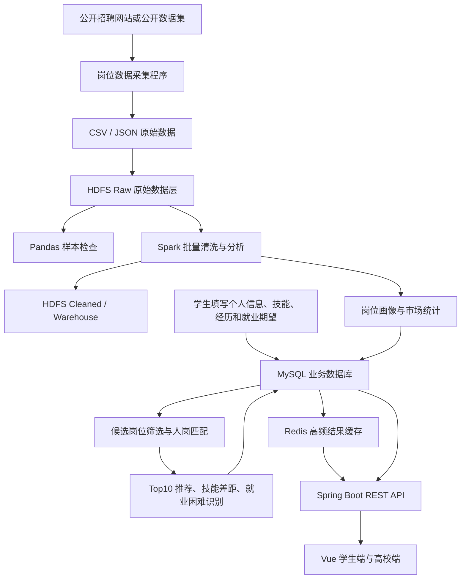
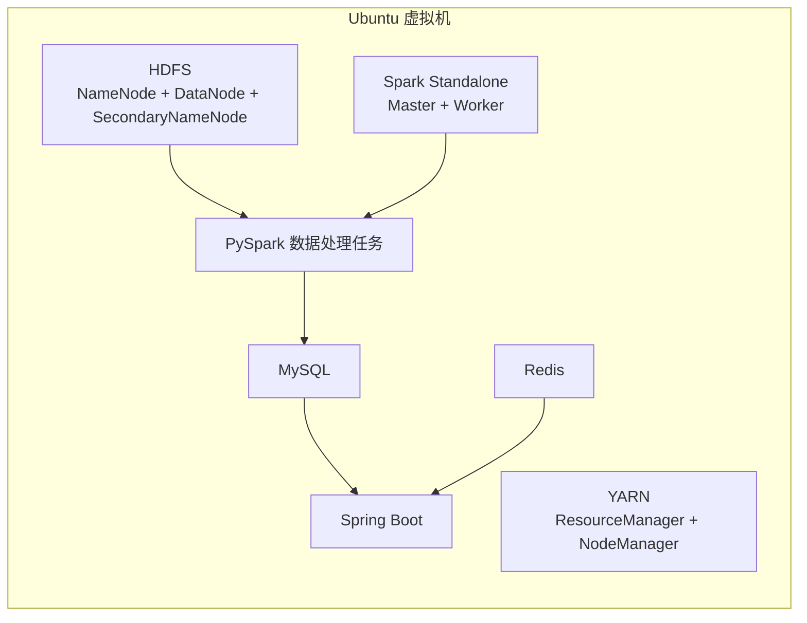

# 基于 Spark 的高校智慧就业大数据分析平台

## 1. 项目简介

本项目面向高校学生就业分析与人才培养决策场景，围绕“学生能力与就业期望—招聘岗位需求—高校就业指导与培养优化”建立数据闭环。

项目首先采集公开招聘岗位数据，将原始岗位数据存入 HDFS，并使用 Pandas、Spark 完成清洗、标准化、统计分析、岗位分类和岗位技能提取。学生在系统中填写个人信息、技能、项目经历、实习经历和就业期望，系统根据学生画像与岗位画像计算匹配度，从近期有效岗位中推荐 Top10 岗位，并分析学生已经满足的条件和仍然缺失的能力。高校端对本校学生的就业期望、匹配情况、就业困难情况、专业技能缺口和不同毕业届情况进行汇总分析，为就业指导、技能培训、专业建设和培养方向调整提供参考。

本项目定位为就业大数据分析平台，不建设完整招聘网站，不涉及企业在线招聘、岗位投递、在线面试、Offer 管理和正式签约，重点完成以下主线：

```text
公开岗位数据采集
        ↓
HDFS 原始数据存储
        ↓
Pandas / Spark 清洗与分析
        ↓
岗位画像与市场需求统计
        ↓
学生画像与候选岗位筛选
        ↓
人岗匹配与 Top10 岗位推荐
        ↓
技能差距与就业困难识别
        ↓
高校就业分析与培养建议
```

岗位数据规模建议为：

```text
原始岗位数据：2 万—5 万条
清洗去重后的有效岗位数据：1 万—3 万条
```

当前岗位数据采集时间跨度较短，因此平台第一阶段主要完成岗位需求现状分析和近期岗位动态分析，不将 5 天左右的数据包装为长期岗位趋势预测。

---

## 2. 当前分工

项目暂时分为五个主要方向。

| 模块 | 主要工作 | 核心技术 |
|---|---|---|
| 数据来源 | 爬取公开岗位数据，保存原始文件、岗位详情和采集日志 | Python、Requests、BeautifulSoup、Scrapy |
| 数据存储与环境 | 配置 Ubuntu 虚拟机、Hadoop、HDFS、Spark、MySQL 和 Redis | Linux、Hadoop、HDFS、Spark、MySQL、Redis、Shell |
| 数据处理与分析 | 使用 Pandas 和 Spark 清洗岗位数据、提取技能、生成统计结果和批量匹配结果 | Pandas、PySpark、Spark SQL、TF-IDF |
| 学生端 | 学生画像、就业期望、岗位查询、期望岗位匹配、Top10 推荐、能力差距 | Spring Boot、MySQL、Redis、Vue、匹配算法 |
| 高校端 | 学生总体分析、匹配分析、就业困难识别、专业技能缺口、毕业届对比 | Spring Boot、Spark SQL、Redis、Vue、ECharts |

除以上五个模块外，项目还设置公共目录，用于存放共享数据模型、接口定义、匹配权重、标准字典、配置文件、测试代码和项目文档。

---

## 3. 总体技术架构



### 3.1 单机伪分布式部署结构

本项目采用一台 Ubuntu 虚拟机搭建伪分布式环境。虚拟机中运行多个服务进程，而不是多台物理机器。



当前环境中可以运行 1 个 Spark Master 和多个 Spark Worker，但多个 Worker 仍共享同一台虚拟机的 CPU 和内存，不等于多台计算节点。项目文档中统一描述为单机伪分布式环境。

---

## 4. 推荐技术栈

### 4.1 数据采集

- Python 3.11
- Requests
- BeautifulSoup4
- Scrapy，可选
- Selenium 或 Playwright，仅在确实需要浏览器渲染时使用
- Pandas
- JSON、CSV
- 日志模块 logging

### 4.2 数据存储

- Ubuntu Server 24.04
- OpenJDK 17
- Hadoop 3.5.0
- HDFS
- Hive，可作为数据仓库和分析表，可选
- MySQL 8.x
- Redis
- Shell

数据职责划分：

```text
HDFS：保存原始岗位数据、清洗数据、历史批次和大规模中间结果
MySQL：保存正式业务数据、标准岗位、匹配结果和高校统计结果
Redis：缓存高频查询结果、推荐结果、统计结果和临时认证状态
```

### 4.3 数据处理和分析

- Pandas
- NumPy
- PySpark
- Spark SQL
- Scikit-learn
- Jieba，可用于中文岗位文本分词
- TF-IDF
- 余弦相似度
- Jaccard 相似度
- 规则加权匹配

### 4.4 后端

- Java 17
- Spring Boot
- Spring Web
- Spring Security
- JWT
- MyBatis-Plus
- Spring Validation
- Spring Data Redis
- Spring Cache
- SpringDoc OpenAPI / Swagger
- Maven

### 4.5 前端

- Vue 3
- Vite
- Element Plus
- Axios
- Vue Router
- Pinia
- ECharts

### 4.6 协作和部署

- Git
- GitHub
- Docker、Docker Compose，可选
- Nginx
- Postman 或 Apifox
- Markdown

---

## 5. 整体项目目录结构

建议仓库名称：

```text
spark-employment-platform
```

完整目录如下：

```text
spark-employment-platform/
├── README.md
├── LICENSE
├── .gitignore
├── .env.example
├── docker-compose.yml
│
├── data_source/                       # 数据来源：岗位数据采集
│   ├── README.md
│   ├── requirements.txt
│   ├── configs/
│   │   ├── crawler.example.yaml
│   │   ├── headers.example.json
│   │   └── field_mapping.yaml
│   ├── crawlers/
│   │   ├── __init__.py
│   │   ├── base_crawler.py
│   │   ├── public_job_crawler.py
│   │   └── dataset_loader.py
│   ├── parsers/
│   │   ├── job_parser.py
│   │   ├── salary_parser.py
│   │   ├── location_parser.py
│   │   └── text_parser.py
│   ├── pipelines/
│   │   ├── save_csv.py
│   │   ├── save_json.py
│   │   └── deduplicate.py
│   ├── scripts/
│   │   ├── run_crawler.py
│   │   ├── validate_raw_data.py
│   │   └── upload_raw_to_hdfs.sh
│   ├── tests/
│   │   ├── test_job_parser.py
│   │   └── test_salary_parser.py
│   └── logs/
│       └── .gitkeep
│
├── infrastructure/                    # 虚拟机、Hadoop、HDFS、Spark、MySQL、Redis
│   ├── README.md
│   ├── hadoop/
│   │   ├── core-site.xml.example
│   │   ├── hdfs-site.xml.example
│   │   ├── mapred-site.xml.example
│   │   ├── yarn-site.xml.example
│   │   └── workers.example
│   ├── spark/
│   │   ├── spark-env.sh.example
│   │   └── workers.example
│   ├── hive/
│   │   ├── hive-site.xml.example
│   │   └── schema/
│   │       ├── ods_tables.sql
│   │       ├── dwd_tables.sql
│   │       ├── dws_tables.sql
│   │       └── ads_tables.sql
│   ├── mysql/
│   │   └── my.cnf.example
│   ├── redis/
│   │   └── redis.conf.example
│   ├── scripts/
│   │   ├── install_java.sh
│   │   ├── init_hdfs_dirs.sh
│   │   ├── start_bigdata.sh
│   │   ├── stop_bigdata.sh
│   │   ├── check_services.sh
│   │   └── upload_to_hdfs.sh
│   └── docs/
│       ├── vm_setup.md
│       ├── hadoop_setup.md
│       ├── hdfs_usage.md
│       ├── spark_setup.md
│       ├── mysql_setup.md
│       └── redis_setup.md
│
├── data_processing/                   # Pandas、Spark 数据处理和统计分析
│   ├── README.md
│   ├── requirements.txt
│   ├── pandas_jobs/
│   │   ├── inspect_raw_data.py
│   │   ├── clean_sample_data.py
│   │   ├── build_dictionaries.py
│   │   └── validate_cleaned_data.py
│   ├── spark_jobs/
│   │   ├── job_cleaning.py
│   │   ├── salary_normalization.py
│   │   ├── job_title_normalization.py
│   │   ├── skill_extraction.py
│   │   ├── job_profile_builder.py
│   │   ├── market_statistics.py
│   │   ├── batch_matching.py
│   │   ├── student_statistics.py
│   │   ├── difficulty_identification.py
│   │   ├── major_skill_gap.py
│   │   ├── cohort_snapshot.py
│   │   └── export_results.py
│   ├── dictionaries/
│   │   ├── skills.csv
│   │   ├── skill_aliases.csv
│   │   ├── majors.csv
│   │   ├── major_job_mapping.csv
│   │   ├── job_categories.csv
│   │   ├── cities.csv
│   │   ├── industries.csv
│   │   ├── education_levels.csv
│   │   └── experience_levels.csv
│   ├── sql/
│   │   ├── job_statistics.sql
│   │   ├── skill_statistics.sql
│   │   ├── salary_statistics.sql
│   │   ├── university_statistics.sql
│   │   └── cohort_statistics.sql
│   ├── tests/
│   │   ├── test_cleaning.py
│   │   ├── test_skill_extraction.py
│   │   ├── test_matching.py
│   │   └── test_statistics.py
│   └── notebooks/
│       └── exploration.ipynb
│
├── recommendation/                    # 人岗匹配规则、解释与离线评估
│   ├── README.md
│   ├── profile/
│   │   ├── student_profile.py
│   │   └── job_profile.py
│   ├── candidate_filter/
│   │   └── candidate_filter.py
│   ├── matching/
│   │   ├── skill_match.py
│   │   ├── major_match.py
│   │   ├── education_match.py
│   │   ├── experience_match.py
│   │   ├── city_match.py
│   │   ├── salary_match.py
│   │   └── total_score.py
│   ├── ranking/
│   │   └── top10_ranker.py
│   ├── explanation/
│   │   ├── skill_gap.py
│   │   ├── recommendation_reason.py
│   │   └── difficulty_reason.py
│   ├── evaluation/
│   │   ├── metrics.py
│   │   └── offline_evaluation.py
│   └── tests/
│       ├── test_matching.py
│       └── test_ranking.py
│
├── backend/                           # Spring Boot 后端
│   ├── README.md
│   ├── pom.xml
│   └── src/
│       ├── main/
│       │   ├── java/com/employment/
│       │   │   ├── EmploymentApplication.java
│       │   │   ├── controller/
│       │   │   │   ├── AuthController.java
│       │   │   │   ├── StudentController.java
│       │   │   │   ├── JobController.java
│       │   │   │   ├── RecommendationController.java
│       │   │   │   ├── UniversityController.java
│       │   │   │   └── AdminController.java
│       │   │   ├── service/
│       │   │   ├── service/impl/
│       │   │   ├── mapper/
│       │   │   ├── entity/
│       │   │   │   ├── User.java
│       │   │   │   ├── Student.java
│       │   │   │   ├── StudentSkill.java
│       │   │   │   ├── StudentProject.java
│       │   │   │   ├── StudentInternship.java
│       │   │   │   ├── JobPreference.java
│       │   │   │   ├── Job.java
│       │   │   │   ├── JobSkill.java
│       │   │   │   ├── JobMatch.java
│       │   │   │   ├── Recommendation.java
│       │   │   │   ├── StudentDifficulty.java
│       │   │   │   └── CohortSnapshot.java
│       │   │   ├── dto/
│       │   │   ├── vo/
│       │   │   ├── config/
│       │   │   │   ├── SecurityConfig.java
│       │   │   │   ├── RedisConfig.java
│       │   │   │   └── OpenApiConfig.java
│       │   │   ├── security/
│       │   │   └── common/
│       │   └── resources/
│       │       ├── application.yml
│       │       └── mapper/
│       └── test/
│           └── java/com/employment/
│
├── frontend/                          # Vue 前端
│   ├── README.md
│   ├── package.json
│   ├── vite.config.js
│   ├── public/
│   └── src/
│       ├── api/
│       │   ├── auth.js
│       │   ├── student.js
│       │   ├── jobs.js
│       │   ├── recommendation.js
│       │   └── university.js
│       ├── assets/
│       ├── components/
│       │   ├── JobCard.vue
│       │   ├── MatchScore.vue
│       │   ├── SkillTags.vue
│       │   ├── FilterPanel.vue
│       │   └── ChartCard.vue
│       ├── layouts/
│       │   ├── StudentLayout.vue
│       │   ├── UniversityLayout.vue
│       │   └── AdminLayout.vue
│       ├── router/
│       ├── stores/
│       ├── utils/
│       ├── views/
│       │   ├── auth/
│       │   │   ├── LoginView.vue
│       │   │   └── RegisterView.vue
│       │   ├── student/
│       │   │   ├── StudentProfileView.vue
│       │   │   ├── JobPreferenceView.vue
│       │   │   ├── JobSearchView.vue
│       │   │   ├── JobDetailView.vue
│       │   │   ├── ExpectedJobMatchView.vue
│       │   │   ├── RecommendationView.vue
│       │   │   └── SkillGapView.vue
│       │   ├── university/
│       │   │   ├── UniversityDashboardView.vue
│       │   │   ├── StudentIntentionView.vue
│       │   │   ├── MatchAnalysisView.vue
│       │   │   ├── TopJobAnalysisView.vue
│       │   │   ├── DifficultyStudentView.vue
│       │   │   ├── MarketDemandView.vue
│       │   │   ├── SkillGapAnalysisView.vue
│       │   │   ├── CohortComparisonView.vue
│       │   │   └── TrainingSuggestionView.vue
│       │   └── admin/
│       │       ├── JobImportView.vue
│       │       ├── DataQualityView.vue
│       │       └── DictionaryManageView.vue
│       ├── App.vue
│       └── main.js
│
├── shared/                            # 各组共享内容
│   ├── schemas/
│   │   ├── raw_job_schema.json
│   │   ├── cleaned_job_schema.json
│   │   ├── student_schema.json
│   │   ├── recommendation_schema.json
│   │   └── cohort_snapshot_schema.json
│   ├── api/
│   │   └── openapi.yaml
│   ├── constants/
│   │   ├── roles.md
│   │   ├── job_status.md
│   │   ├── score_weights.md
│   │   └── cache_keys.md
│   └── examples/
│       ├── raw_job_sample.json
│       ├── cleaned_job_sample.json
│       ├── student_sample.json
│       └── recommendation_sample.json
│
├── database/
│   ├── README.md
│   ├── schema.sql
│   ├── seed/
│   │   ├── majors.sql
│   │   ├── skills.sql
│   │   └── admin_user.sql
│   └── diagrams/
│       └── er_diagram.png
│
├── deployment/
│   ├── backend.Dockerfile
│   ├── frontend.Dockerfile
│   ├── nginx.conf
│   ├── docker-compose.yml
│   └── scripts/
│       ├── deploy.sh
│       ├── backup_mysql.sh
│       └── clear_redis_cache.sh
│
├── docs/
│   ├── 01-requirements.md
│   ├── 02-architecture.md
│   ├── 03-database-design.md
│   ├── 04-api-design.md
│   ├── 05-data-dictionary.md
│   ├── 06-recommendation-design.md
│   ├── 07-hdfs-design.md
│   ├── 08-redis-cache-design.md
│   ├── 09-deployment.md
│   ├── 10-team-tasks.md
│   └── 11-progress-log.md
│
├── tests/
│   ├── integration/
│   ├── fixtures/
│   └── README.md
│
└── scripts/
    ├── init_project.sh
    ├── init_backend.sh
    ├── init_frontend.sh
    ├── run_backend.sh
    ├── run_frontend.sh
    └── run_all_tests.sh
```

---

## 6. 各部分实施计划

# 6.1 数据来源模块

目录：

```text
data_source/
```

负责人主要完成岗位数据的获取、解析、保存、批次记录和质量检查。

### 第一阶段：确认数据来源

优先级如下：

1. 已公开且允许下载的招聘数据集
2. 政府公共就业服务平台公开岗位
3. 企业官方校园招聘页面
4. 明确允许访问和采集的公开招聘页面

不建议将破解验证码、绕过登录、绕过反爬作为项目目标。

### 第二阶段：确定原始岗位字段

原始岗位数据统一保存为以下结构：

```text
source_job_id
job_name
company_name
city
district
industry
company_size
company_type
salary_text
education_text
experience_text
job_description
job_requirement
publish_time
source_name
source_url
crawl_time
crawl_date
crawl_batch_id
first_seen_date
last_seen_date
job_status
```

其中：

```text
first_seen_date：第一次采集到该岗位的日期
last_seen_date：最近一次仍然采集到该岗位的日期
job_status：active、expired 或 unknown
crawl_batch_id：所属采集批次
```

### 第三阶段：实现采集程序

需要完成：

- 请求头配置
- 请求参数配置
- 页面或接口请求
- 分页采集
- 岗位列表和岗位详情采集
- 岗位字段解析
- 异常重试
- 访问频率控制
- 采集日志
- 采集批次记录
- 原始数据保存

### 第四阶段：原始数据检查

检查内容：

- 总数据量
- 字段缺失率
- 重复岗位数量
- 无岗位名称数据
- 无公司名称数据
- 无岗位描述数据
- 无薪资数据
- 采集失败页面
- 各岗位类别数据覆盖情况
- 各城市数据覆盖情况

### 第五阶段：上传 HDFS

原始文件命名建议：

```text
jobs_数据源_日期_批次.json
jobs_数据源_日期_批次.csv
```

上传目录：

```text
/employment-platform/raw/jobs/source=数据源/date=YYYY-MM-DD/
```

### 本模块交付物

- 可运行的数据采集脚本
- 原始岗位数据
- 原始字段说明
- 数据源说明
- 采集日志
- 采集批次记录
- 数据质量报告
- HDFS 上传脚本

---

# 6.2 数据存储与虚拟机模块

目录：

```text
infrastructure/
```

负责人主要完成单台虚拟机伪分布式环境、HDFS 目录、Spark 服务、MySQL、Redis 和数据上传流程。

### 第一阶段：配置虚拟机

建议环境：

```text
Ubuntu Server 24.04
OpenJDK 17
Hadoop 3.5.0
Python 3.11
Spark 3.5.x
MySQL 8.x
Redis
Hive 4.x，可选
```

需要完成：

- 虚拟机网络配置
- SSH 远程连接
- Java 环境
- Hadoop 环境
- HDFS 环境
- YARN 环境
- Spark Standalone 环境
- Python 环境
- MySQL 环境
- Redis 环境
- HDFS Web UI 访问
- Spark Master Web UI 访问

### 第二阶段：创建 HDFS 目录

```text
/employment-platform/
├── raw/
│   ├── jobs/
│   └── dictionaries/
├── cleaned/
│   ├── jobs/
│   └── job_skills/
├── warehouse/
│   ├── ods/
│   ├── dwd/
│   ├── dws/
│   └── ads/
├── output/
│   ├── job_statistics/
│   ├── matching_results/
│   ├── skill_gaps/
│   ├── difficulty_students/
│   └── cohort_snapshots/
└── archive/
    └── graduation_cohorts/
```

### 第三阶段：建立数据分层

ODS：

保存从原始数据转换得到的结构化数据，尽量保留原始字段和采集批次。

DWD：

保存完成去重、标准化、薪资解析、岗位分类、有效性判断和技能提取后的明细数据。

DWS：

保存按岗位、城市、行业、技能、专业和毕业届汇总的数据。

ADS：

保存前端可直接使用的热门岗位、热门技能、匹配结果、就业困难学生、专业技能缺口和届别对比结果。

### 第四阶段：Redis 缓存设计

Redis 不作为正式数据的最终存储，只用于缓存高频访问结果和临时状态。

建议缓存：

```text
student:{studentId}:recommendations
student:{studentId}:match-summary
student:{studentId}:skill-gap
university:overview:{graduationYear}
university:major:{majorId}:statistics
market:hot-jobs
market:hot-skills
market:city-distribution
auth:jwt:blacklist:{tokenId}
```

缓存更新规则：

- 学生修改技能、经历或就业期望后，清除该学生的匹配和推荐缓存。
- Spark 完成新岗位批次分析后，清除市场统计和高校统计缓存。
- 高频统计数据可以设置 30 分钟到 1 小时的过期时间。
- 学生推荐结果可以设置较长过期时间，并在学生信息或岗位批次变化时主动失效。

### 第五阶段：编写管理脚本

至少提供：

```text
启动 Hadoop
停止 Hadoop
启动 Spark
停止 Spark
启动 MySQL
启动 Redis
检查进程
创建 HDFS 目录
上传数据
查看数据
下载结果
清理测试数据
清理 Redis 缓存
```

### 第六阶段：权限和备份

需要保证：

- 项目成员有指定目录写入权限
- 不直接写 HDFS 根目录
- 原始数据只追加、不随意覆盖
- MySQL 定期备份
- Redis 只保存可重新生成的数据
- 重要配置和脚本提交 Git
- 私密环境变量不提交 Git

### 本模块交付物

- 虚拟机配置说明
- Hadoop 和 Spark 配置说明
- MySQL 和 Redis 配置说明
- HDFS 目录初始化脚本
- 数据上传下载脚本
- 服务启动停止脚本
- Redis 缓存设计说明
- 大数据环境检查清单

---

# 6.3 数据处理与分析模块

目录：

```text
data_processing/
```

负责人完成从原始岗位到标准岗位、岗位画像、岗位市场统计、批量匹配和高校统计结果的处理。

### 第一阶段：Pandas 探索

先用少量样本完成：

- 字段查看
- 缺失率统计
- 重复数据检查
- 薪资格式分析
- 学历格式分析
- 经验格式分析
- 城市和行业值检查
- 岗位描述文本检查
- 岗位类别覆盖情况检查

Pandas 主要用于快速试验规则，不承担正式大批量任务。

### 第二阶段：建立标准字典

需要建立：

- 岗位分类字典
- 技能词典
- 技能别名表
- 专业目录
- 专业—岗位类别映射表
- 城市标准表
- 行业标准表
- 学历等级表
- 工作经验等级表

例如：

```text
SpringBoot → Spring Boot
mysql → MySQL
pyspark → Python、Spark
计科 → 计算机科学与技术
北上广深 → 分别保存为标准城市名
```

### 第三阶段：Spark 清洗

需要完成：

- 删除完全重复岗位
- 识别相似重复岗位
- 统一空值
- 统一岗位名称
- 统一城市
- 统一行业
- 统一学历
- 统一经验
- 解析薪资上下限
- 识别应届生岗位
- 判断岗位最近有效状态
- 过滤明显异常数据

### 第四阶段：岗位分类和技能提取

岗位分类示例：

```text
软件开发
前端开发
后端开发
数据分析
大数据开发
人工智能
测试
运维
产品
设计
市场营销
行政管理
```

技能提取第一版采用：

```text
技能词典 + 同义词映射 + 关键词匹配
```

输出：

```text
job_id
skill_name
skill_category
skill_weight
source_text
```

### 第五阶段：建立岗位画像

岗位画像包含：

```text
岗位类别
城市
行业
企业类型
企业规模
薪资上下限
学历要求
经验要求
是否适合应届生
核心技能
采集批次
最近有效日期
岗位状态
```

### 第六阶段：市场需求分析

至少生成：

- 热门岗位排行
- 热门技能排行
- 各城市岗位数量
- 各行业岗位数量
- 各岗位平均薪资
- 学历要求分布
- 经验要求分布
- 应届生岗位占比
- 不同岗位的技能组合
- 每日新增岗位数量
- 近期岗位数量变化
- 近期技能出现频率变化

当前数据采集周期较短时，该模块统一称为“岗位需求现状分析”和“近期岗位动态分析”。

### 第七阶段：批量匹配与统计

Spark 定期完成：

- 全体学生候选岗位筛选
- 全体学生与候选岗位的批量匹配
- Top10 推荐结果生成
- 就业困难学生识别
- 专业技能缺口统计
- 高校端汇总统计
- 毕业届月度快照生成

### 第八阶段：输出处理结果

输出到：

- HDFS Cleaned
- HDFS Warehouse
- Hive DWD、DWS、ADS，可选
- MySQL 业务表和统计表
- Redis 高频结果缓存

正式结果以 MySQL 为准，Redis 中的结果可以从 MySQL 或 Spark 输出重新生成。

### 本模块交付物

- Pandas 探索脚本
- Spark 清洗任务
- 技能和标准字典
- 标准岗位数据
- 岗位技能数据
- 岗位画像
- 市场统计结果
- 批量匹配结果
- 高校统计结果
- 数据处理说明文档

---

# 6.4 学生端模块

涉及目录：

```text
backend/
frontend/src/views/student/
recommendation/
```

学生端负责学生信息、能力画像、就业期望、岗位查询、期望岗位匹配、Top10 推荐和技能差距。

### 第一阶段：用户和学生信息

实现：

- 注册
- 登录
- 获取个人信息
- 修改个人信息
- 填写学院、专业和学历
- 填写毕业年份或毕业届别
- 填写项目经历
- 填写实习经历
- 填写证书情况
- 管理个人技能

学生技能结构：

```text
student_id
skill_name
skill_level
```

### 第二阶段：就业期望

实现：

- 期望岗位
- 期望行业
- 期望城市
- 最低期望薪资
- 最高期望薪资
- 企业规模偏好
- 企业类型偏好
- 是否接受异地

### 第三阶段：岗位查询

实现：

- 岗位关键词搜索
- 城市筛选
- 行业筛选
- 薪资筛选
- 学历筛选
- 经验筛选
- 应届生岗位筛选
- 岗位详情

学生端默认查询最近一次成功采集并清洗后的有效岗位，必要时补充最近 7 天仍有效的岗位。

### 第四阶段：候选岗位筛选

不让一个学生与全部岗位直接进行完整匹配，先根据以下条件筛选候选岗位：

- 岗位属于最近有效岗位
- 岗位类别与学生期望岗位相关
- 岗位学历要求基本符合
- 优先保留适合应届生的岗位
- 城市符合期望或学生接受异地
- 岗位描述和技能字段较完整

筛选后，再对候选岗位执行完整匹配计算。

### 第五阶段：人岗匹配

第一版采用“规则匹配 + 文本相似度 + 加权评分”。

```text
技能匹配度：40%
经历匹配度：20%
专业匹配度：15%
学历匹配度：10%
城市匹配度：10%
薪资匹配度：5%
```

各维度计算方式：

```text
技能匹配度：学生已掌握的岗位技能权重之和 ÷ 岗位技能总权重
经历匹配度：学生项目、实习经历与岗位描述的 TF-IDF 余弦相似度
专业匹配度：根据专业—岗位类别映射表评分
学历匹配度：根据学生学历与岗位最低学历要求评分
城市匹配度：根据期望城市、同省和是否接受异地评分
薪资匹配度：根据期望薪资区间与岗位薪资区间重合程度评分
```

输出：

- 综合匹配分数
- 各维度匹配分数
- 已满足条件
- 未满足条件
- 已匹配技能
- 缺失技能
- 熟练度不足技能
- 推荐理由

### 第六阶段：Top10 岗位推荐

实现：

- 对候选岗位计算综合匹配度
- 按综合匹配度降序排列
- 返回 Top10 匹配岗位
- 展示每个岗位的主要匹配原因
- 展示每个岗位的主要能力差距

不设置同城市推荐、相似岗位推荐等多个独立推荐入口，第一阶段统一以 Top10 综合匹配岗位为核心。

### 第七阶段：技能差距

实现：

- 目标岗位高频技能
- 学生已掌握技能
- 学生缺失技能
- 熟练度不足技能
- 缺失技能优先级
- 简单能力提升建议

### 学生端后端接口

```text
POST   /api/auth/register
POST   /api/auth/login
POST   /api/auth/logout

GET    /api/students/profile
PUT    /api/students/profile
GET    /api/students/skills
POST   /api/students/skills
DELETE /api/students/skills/{id}
GET    /api/students/projects
POST   /api/students/projects
GET    /api/students/internships
POST   /api/students/internships

GET    /api/students/preference
PUT    /api/students/preference

GET    /api/jobs
GET    /api/jobs/{jobId}

GET    /api/recommendations/top10
GET    /api/recommendations/{jobId}/match
GET    /api/recommendations/expected-job-match
GET    /api/recommendations/skill-gap
```

### 学生端页面

- 登录注册
- 个人信息
- 技能管理
- 项目和实习经历
- 就业期望
- 岗位搜索
- 岗位详情
- 期望岗位匹配
- Top10 岗位推荐
- 技能差距

### 本模块交付物

- 学生端数据库表
- 学生端后端接口
- 候选岗位筛选代码
- 匹配推荐代码
- 学生端前端页面
- Redis 推荐缓存
- 接口测试
- 推荐结果示例

---

# 6.5 高校端模块

涉及目录：

```text
backend/src/main/java/com/employment/controller/UniversityController.java
backend/src/main/java/com/employment/service/
frontend/src/views/university/
data_processing/spark_jobs/
```

高校端主要展示本校学生的汇总分析结果。对于就业困难学生，仅向具有相应权限的高校就业指导人员展示必要的学生信息、匹配结果和困难原因。

当前拿不到真实毕业生去向与规模化学生数据，因此高校端先实现不依赖毕业生数据的市场需求分析、专业—岗位—技能映射和培养方向场景推演。学生汇总、困难学生、毕业届对比等功能仅在获得授权匿名数据后启用，不使用伪造数据形成正式结论。

### 第一阶段：学生总体情况分析

统计：

- 学生总人数
- 已完善画像学生人数
- 各学院、专业、年级和毕业届人数
- 平均期望岗位匹配度
- 高匹配、中匹配、低匹配学生人数
- 就业困难学生人数和比例

### 第二阶段：学生就业期望分析

统计：

- 各专业学生数量
- 期望岗位排行
- 期望行业排行
- 期望城市排行
- 期望薪资分布

### 第三阶段：学生能力分析

统计：

- 各专业高频技能
- 各技能掌握率
- 有项目经历学生比例
- 有实习经历学生比例
- 常见证书分布

### 第四阶段：人岗匹配分析

统计：

- 全校平均匹配度
- 各专业平均匹配度
- 各期望岗位平均匹配度
- 不同年级和毕业届匹配度
- 高匹配和低匹配学生比例
- 常见不满足条件

### 第五阶段：Top10 匹配岗位分析

统计：

- 全校 Top10 匹配岗位
- 各学院 Top10 匹配岗位
- 各专业 Top10 匹配岗位
- 各年级和毕业届 Top10 匹配岗位
- 每个岗位对应学生人数
- 每个岗位平均匹配度

### 第六阶段：就业困难学生识别

平台识别的是“当前能力和就业期望与岗位市场要求差距较大的学生”，不直接预测学生是否能够就业。

判断依据：

- 期望岗位匹配度较低
- Top10 中最高匹配度仍较低
- 缺失多个目标岗位核心技能
- 项目和实习经历与目标岗位相关性较低
- 期望岗位、城市或薪资限制较多

输出：

- 就业困难学生人数
- 各专业就业困难学生比例
- 困难学生名单
- 困难程度
- 主要困难原因
- 缺失能力
- 建议提升方向

### 第七阶段：市场需求分析

展示：

- 热门岗位
- 热门技能
- 热门城市
- 热门行业
- 应届生岗位数量
- 学历要求
- 经验要求
- 岗位薪资
- 近期岗位数量变化

### 第八阶段：专业与岗位需求差距分析

实现：

- 某专业对应岗位
- 岗位数量
- 岗位薪资
- 岗位高频技能
- 学生技能掌握率
- 市场技能需求率
- 专业技能供需差值
- 专业学生平均岗位匹配度
- 专业就业困难学生比例

### 第九阶段：毕业届管理与对比

学生数据分为三种状态：

#### 当前数据

保存学生当前最新的能力、就业期望、匹配度、Top10 推荐、能力差距和困难标记。

#### 月度快照

建议每月最后一天保存一次，包括：

- 该届学生人数
- 平均岗位匹配度
- 高、中、低匹配学生人数
- 就业困难学生人数
- Top10 期望岗位
- Top10 匹配岗位
- 普遍缺失技能
- 各专业平均匹配度

#### 毕业归档

学生毕业时保存该届最后一次分析结果，用于：

- 不同毕业届对比
- 不同专业对比
- 学生能力变化分析
- 培养方案与市场需求对齐度分析

### 第十阶段：指导建议

第一版使用规则生成建议。

示例规则：

```text
岗位需求率 > 50%，学生掌握率 < 30%
→ 标记为重点缺失技能

某岗位招聘数量较高，专业学生匹配度较低
→ 建议增加该岗位方向的实践训练

某专业就业困难学生比例较高
→ 建议针对该专业开展重点就业指导和能力培训
```

输出：

- 就业指导建议
- 技能培训建议
- 项目实践建议
- 校企合作方向
- 专业培养方向参考

### 高校端后端接口

```text
GET /api/university/overview
GET /api/university/student-intentions
GET /api/university/student-skills
GET /api/university/match-analysis
GET /api/university/top-jobs
GET /api/university/difficulty-students
GET /api/university/major-skill-gap
GET /api/university/market-demand
GET /api/university/cohort-comparison
GET /api/university/training-suggestions
GET /api/university/training-alignment
```

### 高校端页面

- 高校就业分析总览
- 学生就业期望分析
- 学生能力分析
- 学生与期望岗位匹配分析
- Top10 匹配岗位分析
- 就业困难学生分析
- 岗位市场需求分析
- 专业技能差距分析
- 毕业届对比分析
- 培养与就业指导建议
- 培养方向场景分析

### 本模块交付物

- 高校汇总统计任务
- 就业困难学生识别任务
- 月度快照任务
- 高校端后端接口
- Redis 高校统计缓存
- ECharts 数据结构
- 高校分析页面
- 建议生成规则
- 高校端演示数据和说明

---

## 7. 各模块数据接口

为了避免不同小组各自设计字段，必须统一共享数据格式。

### 7.1 原始岗位数据

```json
{
  "source_job_id": "source-10001",
  "job_name": "大数据开发工程师",
  "company_name": "示例科技公司",
  "city": "成都",
  "industry": "软件和信息技术服务业",
  "salary_text": "8K-12K",
  "education_text": "本科",
  "experience_text": "经验不限",
  "job_description": "负责数据平台开发……",
  "job_requirement": "掌握 Java、Spark、Hive……",
  "publish_time": "2026-07-10",
  "source_name": "公开数据源",
  "source_url": "https://example.com/job/10001",
  "crawl_time": "2026-07-10 10:00:00",
  "crawl_date": "2026-07-10",
  "crawl_batch_id": "batch-20260710-01",
  "first_seen_date": "2026-07-10",
  "last_seen_date": "2026-07-10",
  "job_status": "active"
}
```

### 7.2 清洗后岗位数据

```json
{
  "job_id": 10001,
  "job_name": "大数据开发工程师",
  "standard_job_name": "大数据开发工程师",
  "job_category": "大数据开发",
  "company_name": "示例科技公司",
  "city": "成都",
  "industry": "软件和信息技术服务业",
  "salary_min": 8000,
  "salary_max": 12000,
  "education_requirement": "本科",
  "experience_requirement": "经验不限",
  "graduate_friendly": true,
  "skills": ["Java", "Spark", "Hive"],
  "data_source": "公开数据源",
  "last_seen_date": "2026-07-10",
  "job_status": "active"
}
```

### 7.3 学生数据

```json
{
  "student_id": 1001,
  "college": "计算机科学学院",
  "major": "数据科学与大数据技术",
  "education": "本科",
  "graduation_year": 2027,
  "skills": [
    {"skill_name": "Python", "skill_level": 4},
    {"skill_name": "SQL", "skill_level": 4},
    {"skill_name": "Spark", "skill_level": 3},
    {"skill_name": "Hive", "skill_level": 3}
  ],
  "expected_jobs": ["大数据开发工程师"],
  "expected_cities": ["成都", "重庆"],
  "expected_industries": ["软件和信息技术服务业"],
  "salary_min": 8000,
  "salary_max": 12000,
  "accept_remote_city": true
}
```

### 7.4 推荐结果

```json
{
  "student_id": 1001,
  "job_id": 10001,
  "rank": 1,
  "total_score": 84,
  "skill_score": 75,
  "experience_score": 80,
  "major_score": 100,
  "education_score": 100,
  "city_score": 100,
  "salary_score": 90,
  "matched_skills": ["Spark", "Hive"],
  "missing_skills": ["Java"],
  "insufficient_skills": ["Spark"],
  "recommendation_reason": "专业、城市和薪资符合，已掌握部分核心技能"
}
```

### 7.5 就业困难识别结果

```json
{
  "student_id": 1001,
  "difficulty_level": "medium",
  "expected_job_score": 52,
  "top10_max_score": 58,
  "missing_core_skills": ["Java", "Flink"],
  "main_reasons": [
    "期望岗位匹配度较低",
    "缺失多个目标岗位核心技能"
  ],
  "improvement_suggestions": [
    "补充 Java 基础和项目实践",
    "完成一个大数据处理类项目"
  ]
}
```

### 7.6 毕业届月度快照

```json
{
  "graduation_year": 2027,
  "snapshot_date": "2026-09-30",
  "student_count": 800,
  "average_match_score": 71.5,
  "high_match_count": 260,
  "medium_match_count": 390,
  "low_match_count": 150,
  "difficulty_student_count": 120,
  "top_expected_jobs": ["Java开发工程师", "数据分析师"],
  "top_matched_jobs": ["Java开发工程师", "测试工程师"],
  "common_missing_skills": ["Spring Boot", "Redis", "Spark"]
}
```

---

## 8. 建议数据库表

第一版至少建立：

```text
user
student
student_skill
student_project
student_internship
student_certificate
job_preference
company
job
job_skill
job_crawl_batch
job_match
recommendation
student_difficulty
student_match_snapshot
cohort_snapshot
cohort_archive
major_statistics
major_skill_gap
market_demand_statistics
```

表的主要职责：

```text
job_crawl_batch：记录每次岗位采集批次、日期、数量和质量
job_match：保存学生与岗位的各维度匹配分数
recommendation：保存学生 Top10 推荐结果
student_difficulty：保存就业困难等级、原因和建议
student_match_snapshot：保存学生在不同时间点的匹配状态
cohort_snapshot：保存某毕业届每月总体分析结果
cohort_archive：保存毕业届最终归档结果
```

Redis 只保存缓存，不替代以上 MySQL 表。

详细字段统一写入：

```text
docs/03-database-design.md
database/schema.sql
```

禁止不同成员在本地自行修改字段但不提交文档。

---

## 9. GitHub 协作规范

### 9.1 分支

```text
main
最终稳定版本

develop
日常集成版本

feature/data-source
岗位数据采集

feature/infrastructure
Hadoop、HDFS、Spark、MySQL、Redis和虚拟机

feature/data-processing
Pandas和Spark处理

feature/student
学生端

feature/university
高校端

feature/recommendation
匹配推荐

feature/backend
Spring Boot 后端

feature/frontend
前端公共组件
```

### 9.2 开发流程

```bash
git checkout develop
git pull origin develop

git checkout -b feature/data-processing

# 完成开发和测试
git add .
git commit -m "feat: 完成岗位薪资标准化"

git push origin feature/data-processing
```

随后在 GitHub 创建 Pull Request，请其他成员检查后合并到 develop。

### 9.3 提交信息

```text
feat: 新功能
fix: 修复问题
docs: 修改文档
refactor: 重构代码
test: 增加测试
chore: 环境或依赖修改
```

示例：

```text
feat: 增加学生就业期望接口
fix: 修复8K-12K薪资解析错误
docs: 补充Redis缓存设计说明
```

### 9.4 禁止提交

- `.env`
- 数据库密码
- Redis 密码
- 网站 Cookie
- 登录 Token
- 私钥
- 大型原始数据
- `node_modules`
- Python 虚拟环境
- Maven 构建目录 `target`
- Hadoop 运行数据目录
- Spark 日志

大型数据放在 HDFS 或共享存储中，GitHub 只保存少量样例数据。

---

## 10. 第一阶段实施顺序

### 第1步：建立仓库和目录

创建完整目录，提交空目录中的 `.gitkeep` 和各模块 `README.md`。

### 第2步：确定共享字段

先完成：

- 原始岗位数据格式
- 清洗后岗位格式
- 学生信息格式
- 推荐结果格式
- 就业困难结果格式
- 毕业届快照格式
- 数据库初版结构
- API 初版文档
- Redis 缓存键规范

### 第3步：各组并行开发

数据来源组：

- 获取第一批岗位数据
- 输出原始 CSV 或 JSON
- 建立岗位采集批次记录

基础设施组：

- 配置单台 Ubuntu 虚拟机
- 建立 HDFS 目录
- 配置 Spark、MySQL 和 Redis
- 提供上传脚本和服务管理脚本

数据处理组：

- 使用样例数据调试清洗规则
- 完成标准字典
- 完成岗位画像和市场统计任务

学生端组：

- 使用样例岗位数据开发页面和接口
- 完成学生画像和就业期望填写

高校端组：

- 使用样例统计数据开发可视化页面
- 完成就业困难学生和毕业届分析页面

### 第4步：第一次集成

完成：

```text
原始岗位数据
→ HDFS
→ Spark清洗
→ MySQL
→ Redis缓存
→ Spring Boot岗位接口
→ Vue岗位列表
```

### 第5步：第二次集成

完成：

```text
学生信息
+ 清洗后岗位
→ 候选岗位筛选
→ 人岗匹配
→ Top10推荐
→ 技能差距
```

### 第6步：第三次集成

完成：

```text
学生匹配结果
+ 岗位市场统计
→ 就业困难学生识别
→ 高校统计分析
→ 毕业届月度快照
→ 高校端页面
```

---

## 11. 项目里程碑

### 里程碑一：目录与环境

- GitHub 仓库可用
- 各成员完成克隆
- 项目目录建立
- 虚拟机可 SSH 连接
- HDFS 正常运行
- Spark 正常运行
- MySQL 正常运行
- Redis 正常运行

### 里程碑二：数据链路

- 已取得岗位数据
- 可上传 HDFS
- Spark 可读取数据
- 完成基础清洗
- 输出标准岗位表
- 标准岗位可同步到 MySQL

### 里程碑三：基础系统

- 学生注册登录
- 学生填写个人能力和就业期望
- 岗位查询和详情
- 高校基础看板
- Redis 缓存可正常读取和失效

### 里程碑四：核心算法

- 候选岗位筛选
- 计算各维度匹配度
- 推荐 Top10 岗位
- 输出技能差距
- 展示推荐理由
- 识别就业困难学生

### 里程碑五：高校分析

- 学生总体情况分析
- Top10 匹配岗位分析
- 就业困难学生分析
- 专业技能缺口分析
- 毕业届月度快照和届别对比

### 里程碑六：完整联调

- 数据采集到前端展示全流程跑通
- 高校端可查看统计结果
- 主要接口测试通过
- 缓存更新逻辑正确
- 项目可在 Linux 环境运行

---

## 12. 第一版验收功能

### 数据来源

- 能获取并保存一批真实岗位数据
- 有数据来源、采集时间和批次记录
- 可重复执行采集任务
- 原始数据达到一定规模并覆盖主要岗位类别

### 数据存储

- 原始岗位数据可上传 HDFS
- HDFS 目录结构清晰
- MySQL 能保存标准岗位和分析结果
- Redis 能缓存推荐和统计结果
- 能查看和下载处理结果

### 数据处理

- 岗位去重
- 薪资标准化
- 城市、学历和经验标准化
- 岗位分类
- 技能提取
- 岗位有效性判断
- 热门岗位和热门技能统计
- 近期岗位动态分析

### 学生端

- 注册登录
- 填写个人信息、技能和经历
- 填写就业期望
- 查询岗位
- 查看岗位详情
- 查看期望岗位匹配度
- 查看 Top10 推荐岗位
- 查看各维度匹配分数
- 查看缺失技能和能力提升方向

### 高校端

- 查看学生总体情况
- 查看毕业生就业期望
- 查看热门岗位和热门技能
- 查看专业平均匹配度
- 查看 Top10 匹配岗位
- 查看就业困难学生
- 查看专业技能差距
- 查看毕业届月度快照和届别对比
- 查看就业指导和培养建议

---

## 13. 第一版暂不实现

- 企业注册和岗位发布
- 在线投递和面试
- Offer 和正式签约管理
- 复杂简历自动解析
- 深度学习推荐模型
- 长期岗位趋势预测
- 实时流数据处理
- Kafka 和 Flink
- Kubernetes
- 多学校复杂权限体系
- 自动修改培养方案
- 绕过招聘网站验证码或访问限制

---

## 14. 项目初始化命令

在本地执行：

```bash
mkdir -p spark-employment-platform
cd spark-employment-platform

mkdir -p \
data_source/{configs,crawlers,parsers,pipelines,scripts,tests,logs} \
infrastructure/{hadoop,spark,hive/schema,mysql,redis,scripts,docs} \
data_processing/{pandas_jobs,spark_jobs,dictionaries,sql,tests,notebooks} \
recommendation/{profile,candidate_filter,matching,ranking,explanation,evaluation,tests} \
backend/src/main/java/com/employment/{controller,service,service/impl,mapper,entity,dto,vo,config,security,common} \
backend/src/main/resources/mapper \
backend/src/test/java/com/employment \
frontend/src/{api,assets,components,layouts,router,stores,utils} \
frontend/src/views/{auth,student,university,admin} \
shared/{schemas,api,constants,examples} \
database/{seed,diagrams} \
deployment/scripts \
docs \
tests/{integration,fixtures} \
scripts

touch README.md LICENSE .gitignore .env.example
touch data_source/logs/.gitkeep
touch backend/pom.xml
```

初始化 Git：

```bash
git init
git branch -M main
git add .
git commit -m "chore: 初始化项目目录"
```

关联 GitHub 仓库：

```bash
git remote add origin 你的GitHub仓库地址
git push -u origin main
```

创建开发分支：

```bash
git checkout -b develop
git push -u origin develop
```

---

## 15. README 维护要求

根目录 README 负责说明：

- 项目是什么
- 项目整体架构
- 项目目录结构
- 如何启动
- 如何参与开发
- 当前完成进度

每个模块自己的 README 负责说明：

- 模块职责
- 环境安装
- 输入数据
- 输出数据
- 运行命令
- 测试方法
- 当前负责人
- 当前进度

以下内容发生变化时必须同步更新文档：

- 数据字段
- 数据库表
- API 接口
- 匹配权重
- Redis 缓存键
- HDFS 目录
- 项目目录
- 部署方式
